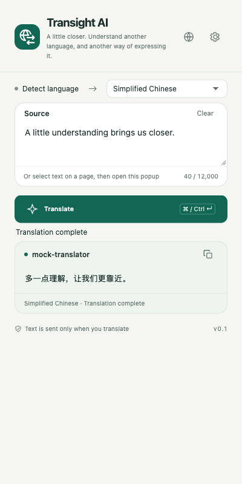
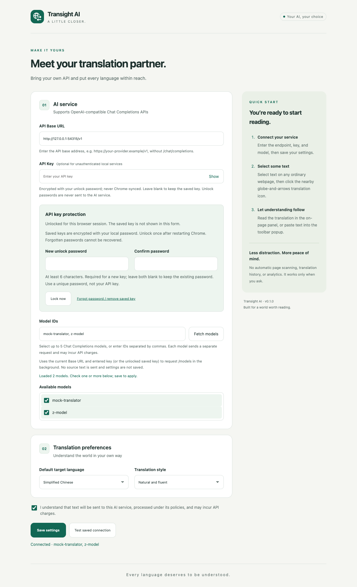
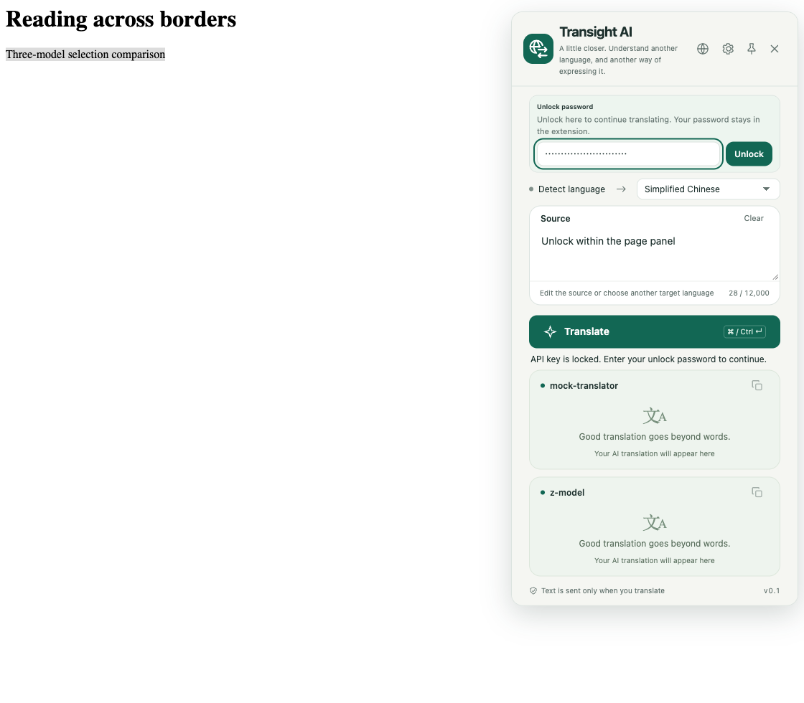
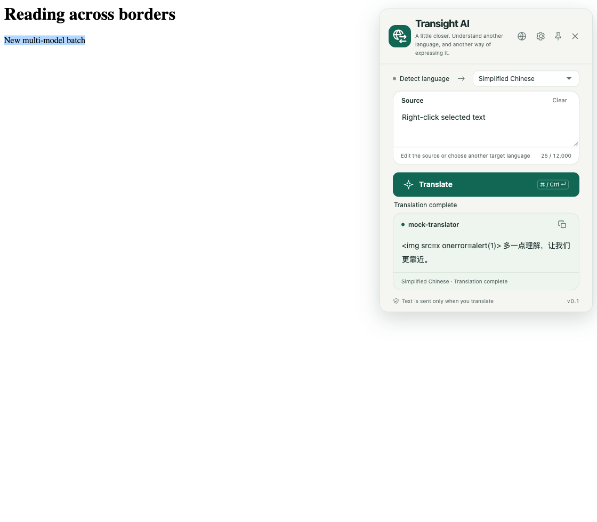
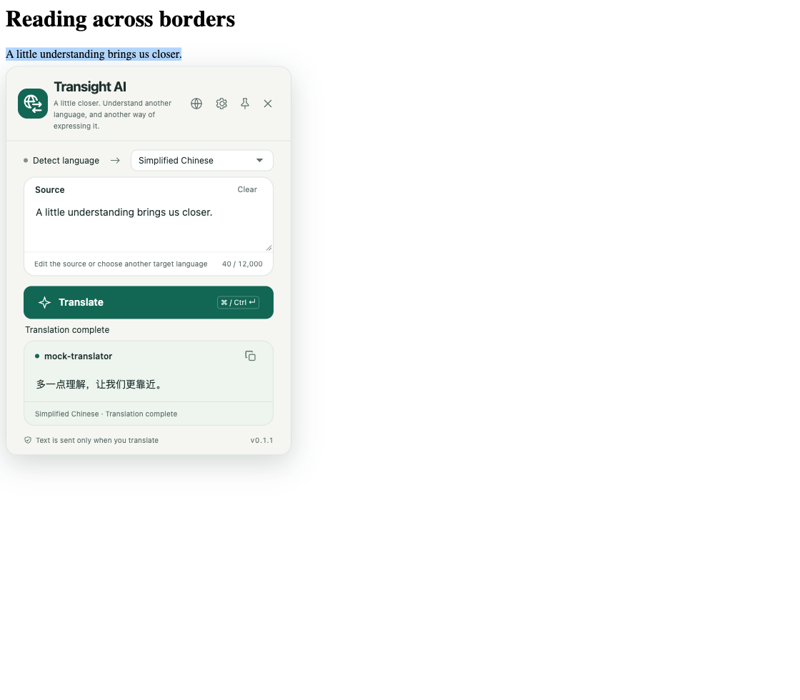
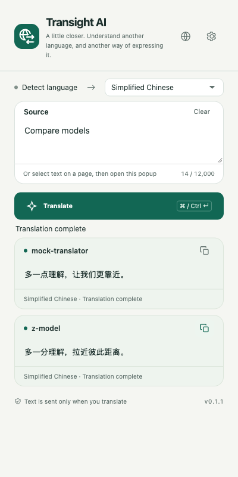
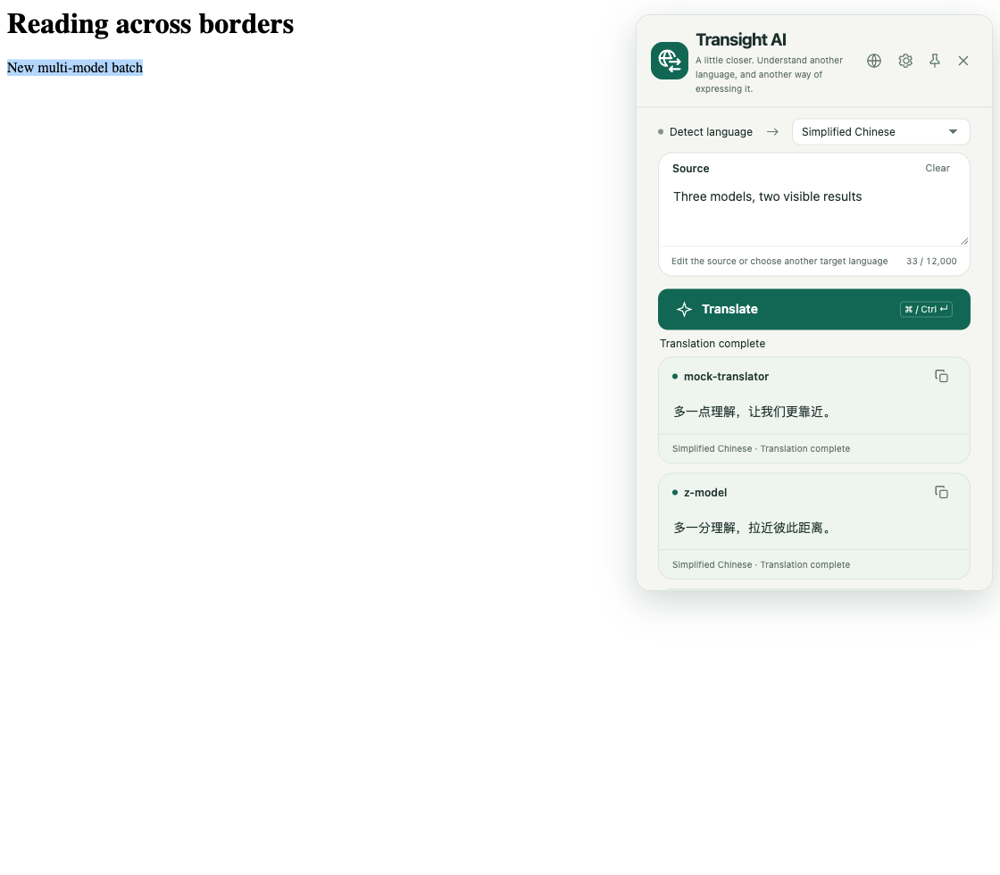
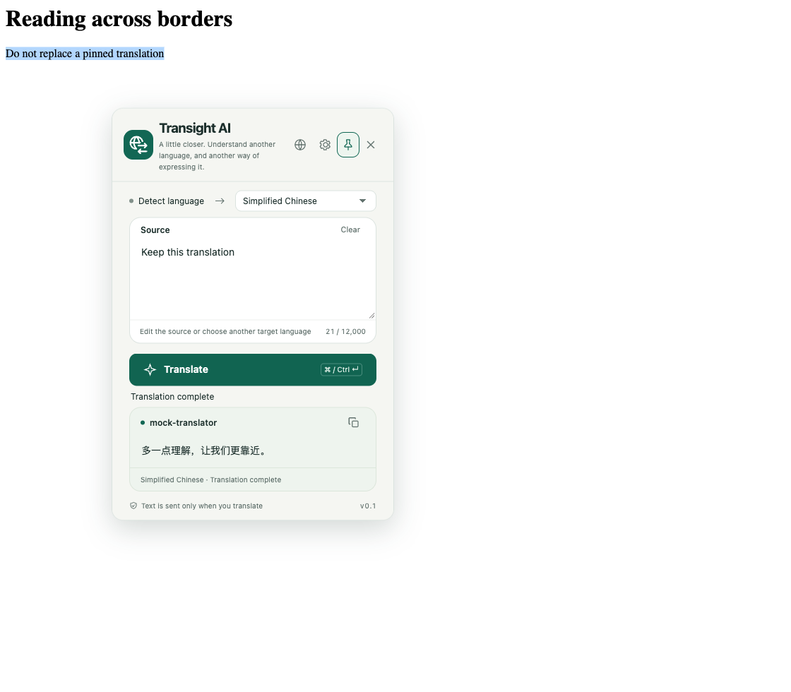
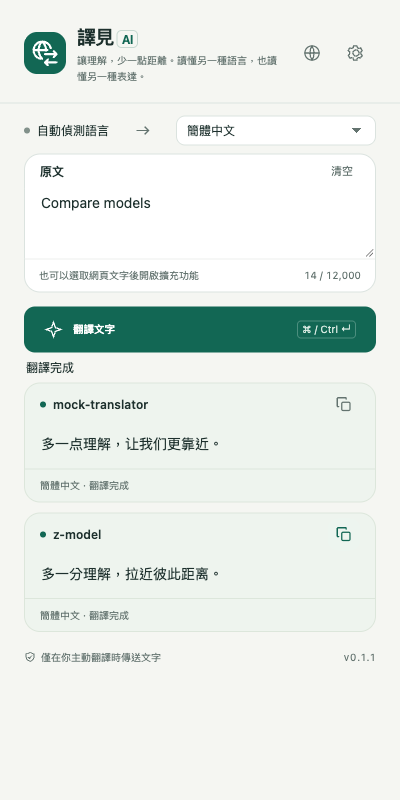
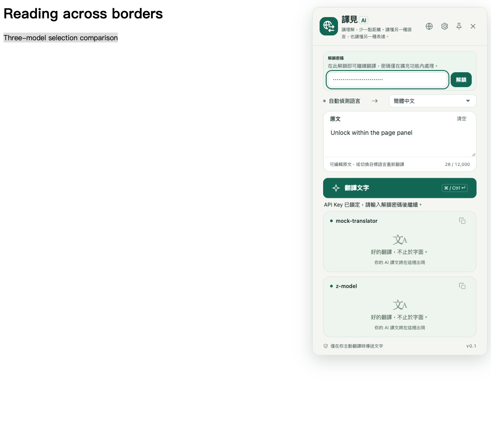

# Transight AI · Translate on Demand

[简体中文](README.md) | **English**

An AI translation Chrome extension MVP built with **Manifest V3 and vanilla JavaScript / HTML / CSS**. It has no runtime dependencies or embedded API keys. Run `npm run build` to generate an unpacked extension in `dist/`, ready to load into Chrome. No ZIP is generated.

## Features

- **Simplified Chinese, Traditional Chinese, and English UI**: follows Chrome’s UI language automatically, with English as the fallback for unsupported languages.

- **Toolbar translation**: automatically detect the source language, type or paste text, choose a target language, translate, and copy the result.
- **Selected text**: select text on a webpage before opening the extension to populate the source field. The text is not sent automatically.
- **Selection translation**: enabled by default on all ordinary HTTP/HTTPS webpages. Select text, then click the green globe-and-exchange-arrow icon. Only clicking sends a request; the panel shares the toolbar UI.
- **Context-menu translation**: right-click selected text and choose “用译见 AI 翻译选中文字” (Translate selected text with Transight AI) to display the translation in an on-page panel.
- **10 target languages**: Simplified Chinese, Traditional Chinese, English, Japanese, Korean, French, German, Spanish, Russian, and Portuguese.
- **3 translation styles**: natural and fluent, faithful to the original, and professional and precise.
- **Configurable service**: compatible with `POST /chat/completions`, with a custom Base URL, API key, and model ID. Local services without authentication are supported.
- **Multi-model comparison**: select up to 5 models using checkboxes or comma-separated IDs. Requests run in parallel with independent result, loading/error, and copy controls. Legacy single-model settings remain compatible.
- **Connection testing**, loading indicators, timeouts, and actionable authentication, rate-limit, and model error messages.
- **All-site selection**: HTTP/HTTPS access is declared at installation/update, without per-site enable buttons. Only clicking the translate button sends the selected text.

## Screenshots

These screenshots are synced from the latest browser tests using a local mock API (October 2, 2026). They show the actual extension UI, not the translation quality of a real model. API keys are not displayed, and test unlock passwords are masked. The screenshots below show the English UI; Simplified and Traditional Chinese are also supported.

### Toolbar translation

Type text or import a webpage selection, choose a target language, and view or copy the translation.



### AI service settings

Configure the API endpoint, password-protected key, model, and translation preferences, then test the connection. The screenshot uses a local mock service; saved keys are not filled back into the form.



### Unlock without leaving the panel

When the API key is locked, enter your password directly in the toolbar popup or on-page panel. The compact form resumes pending translation after unlocking, without a trip to Settings. The screenshot below shows the on-page panel.



### On-page translation panel

Translations appear in the upper-right corner of the webpage and can be copied or dismissed. The HTML-like string in this screenshot is a security test fixture: it is rendered as plain text, not executed.



### Selection Translation

Click the translation icon beside selected text to open the shared translation interface near the selection. Edit the source, change the target language, or copy the result.



## 1. Build and Load the Extension

Run the following in the project root. Node.js 20+ is required; no dependency installation is needed:

```sh
npm run build
```

1. Open `chrome://extensions` in Chrome.
2. Turn on **Developer mode** in the upper-right corner.
3. Click **Load unpacked**.
4. Select **the `dist/` directory inside this project**, which contains the generated `manifest.json`. Do not select the project root.
5. Pin “译见 AI” from Chrome's extensions menu to the toolbar.

The minimum Chrome version is set to 114 in `manifest.json`. After changing the source, run `npm run build`, click **Reload** on the extension management page, and reopen the popup. Also refresh webpages where the translation panel has already been injected.

## Interface Language

By default, the extension follows Chrome’s **UI language**, not the current webpage. Click the **globe icon (Interface language)** next to Settings in the popup to choose **Follow browser / 简体中文 / 繁體中文 / English**. Your selection is saved for future sessions.

- Simplified Chinese browsers (`zh-CN`, `zh-SG`, `zh-Hans`): Simplified Chinese UI.
- Traditional Chinese browsers (`zh-TW`, `zh-HK`, `zh-MO`, `zh-Hant`): Traditional Chinese UI. Explicit `Hans` / `Hant` script tags take precedence over region tags.
- Manual changes synchronize the toolbar, settings, context menu and open on-page panels without clearing translations or changing translation targets or model settings.
- English browsers: English UI.
- Unsupported UI languages: English fallback (`default_locale: en`).

Manual switching immediately updates the popup, open settings pages, context menu, and on-page panels without clearing source text, translations, or unsaved settings. The name and description in Chrome’s extension manager still follow the browser language. After changing Chrome’s UI language and restarting the browser, reopen the extension and refresh any existing pages. **UI language and translation target language are independent**; saved translation preferences are not overwritten. The toolbar, settings page, popup, selection trigger, and on-page panels share a language-neutral globe-and-exchange-arrow mark on the existing green rounded background.

The vector source is `assets/translation-mark.svg`; `assets/icon.svg` and the sized PNGs are committed, so ordinary builds require no image dependency. After editing the mark, install the development tool `sharp` and run `npm run icons` to regenerate the toolbar assets (or point `SHARP_MODULE` to an existing module entry). Keep the inline SVGs in the selection trigger, settings page, popup, and on-page panel in sync with the vector source; tests check that the paths match. The trigger requires no network image request.

## 2. Configure Your AI Service

Click the settings button in the upper-right corner of the popup.

| Field | What to enter |
| --- | --- |
| API Base URL | Your API base address, such as `https://api.openai.com/v1` or `https://your-gateway.example/v1`, not the provider's website homepage |
| API Key | A key created in your provider's console; leave blank for a local service that does not require authentication |
| Model IDs | Fetch and check 1–5 available models, or manually enter comma-separated IDs for models that support Chat Completions |
| Default target language | The initial toolbar language and the language used for context-menu translation |
| Translation style | The prompt style applied to all new translations |

Check the text-sharing and cost acknowledgment, then click **Save settings**. Then click “测试已保存的连接” (Test saved connection). The test sends the fixed text `Hello, world!` to every selected model; each request may incur an API charge.

- If your provider supplies a full `/chat/completions` endpoint, the extension strips that suffix automatically.
- `/v1` is not added automatically. Enter the address required by your provider; gateways with custom path prefixes are supported.
- Remote services must use HTTPS. For local development, `http://localhost:PORT` and `http://127.0.0.1:PORT` are allowed.
- The extension declares HTTP/HTTPS access globally. Saving a different provider does not remove access needed for all-site selection translation.
- A ChatGPT website subscription is not an API credential. You need API access from a provider.
- This is a Chat Completions protocol client. It does not directly support Anthropic Messages, the native Gemini protocol, or OpenAI Responses. A compatible gateway can be used instead.

### Password-protected API keys

- When saving an API key, set and confirm a separate unlock password of **at least 6 characters**. Unauthenticated services may leave both the key and password blank.
- Unlock once in the toolbar popup, selection panel, or Settings after a browser restart or extension reload/update. Closing the popup does not lock it. All translation, connection-test, and model-list requests resolve saved credentials in the background worker.
- Locked translation views show an inline unlock form and resume pending translation after unlocking. Other views share the unlocked session. The password field lives in an extension-origin iframe; passwords never pass through the webpage or content script. Password changes and resets remain in Settings.
- The saved key is never filled back into the form. Leave the key/password fields blank to keep it while editing preferences; supply only a new password and confirmation to rotate the password. Replacing the key requires a password. Changing endpoints requires explicitly entering a key for that endpoint, rather than silently reusing saved credentials.
- **Lock now** clears the session key and cancels active translation/model requests. It cannot retract requests already received by a provider.
- **Forgot password / remove saved key** asks for confirmation, then deletes the ciphertext and session key, keeping other settings. Forgotten passwords cannot be recovered; re-enter your API key. Local removal does not revoke the key at the provider.
- **Legacy migration:** on update, legacy plaintext keys are quarantined and cannot be used for translation or model discovery. Set a password in Settings and save. The plaintext is removed only when the encrypted vault is successfully persisted, so an interrupted migration or browser restart cannot lose your only key. Until then, the legacy key remains plaintext; complete migration promptly. This does not guarantee secure erasure of old backups or storage-engine remnants; rotate previously exposed keys at the provider.

### Fetch and select models

1. Enter the API Base URL and API key (optional for unauthenticated local services).
2. Click **Fetch models**. No model ID, saved settings, or translation consent is needed for discovery.
3. Check the desired **Available models** (up to 5), then click **Save settings**. You can also enter comma-separated IDs manually.

Discovery sends `GET /models` from the background using the current address and entered key (or the unlocked saved key). It sends no source text, does not save settings, and does not automatically replace the selected models. Editing the address or key clears the list and cancels the old request. Manual entry remains available if discovery is unsupported, empty, or fails. A listed model is not guaranteed to support Chat Completions.

### Multi-model translation

In the toolbar and selection panels, **Try again** in a failed card is a clickable action that retries only that model, preserving other results and the original source/target language. Duplicate clicks cannot start another request while that card is loading; other failed cards can still be retried independently.

In the fetched model list, check 1–5 models, or enter IDs separated by commas (for example, `model-a, model-b`). All selected models share the current Base URL, API key, target language, and style; this is not a multi-provider configuration.

- One translation sends the source to each selected model concurrently. Each request may incur separate API charges. The saved-connection test also calls every selected model.
- Toolbar and selection panels show an ordered vertical list of model cards. Each result appears as soon as it completes, with its own loading/error state and copy button.
- Copy controls are icon-only. A successful copy shows a checkmark for 1.5 seconds, then restores the copy icon without a success text message. Feedback is independent per model; copying again restarts the timer.
- One failed model does not block successful results. Partial and total failures are reported separately.
- The source input is now 70px high by default and remains resizable.
- Changing the target in the selection panel runs all models again. Closing the panel cancels the batch; late results cannot overwrite a newer translation.
- Existing single-model settings are automatically interpreted as a one-item list. The context-menu panel also supports multiple model results.



With three or more models, the shared context-menu/selection panel fits the first two result cards and scrolls to the rest:



## 3. Everyday Use

### Toolbar

Type or paste text → choose a target language → click “翻译文字” (Translate text). The keyboard shortcut is `⌘ Enter` on macOS or `Ctrl Enter` on Windows/Linux. Each request accepts up to 12,000 characters. Closing the popup does not preserve the current source text or translation. If a request has already been sent, closing the popup does not guarantee that provider charges will be canceled.

### Webpage selections

Select text → right-click → choose “用译见 AI 翻译选中文字” (Translate selected text with Transight AI). Right-click and selection translation reuse the same floating view, including source editing, target selection, multiple models, per-model retry/copy, pinning, and dragging. An explicit new right-click translation replaces the current view, even when pinned. Only the latest result is shown when translations are requested consecutively. A late response will not reopen a dismissed panel.

Chrome internal pages, the Chrome Web Store, some PDF viewers, and restricted embedded frames may block panel injection. If injection fails, the extension attempts to open a standalone translation window with the selection prefilled; click Translate to continue. You can also paste text directly into the toolbar popup. Automatic selection extraction from cross-origin iframes is not guaranteed.

### On-page Selection Translation

**Pin and move:** Click the header’s pin button to keep the current translation open. Outside clicks, page scrolling, and new text selections will not dismiss or replace it. Drag a non-button area of the header to move it within the viewport. You can also focus the header and use arrow keys (Shift for larger steps). Click the pin again to unpin; Close and Esc always remain available. Pinning resets when the panel closes or the page reloads.



1. Reload the extension and refresh open webpages. If Chrome requests confirmation of the new website permissions, allow them.
2. Select text on any ordinary HTTP/HTTPS webpage. A compact green translate button appears nearby and hides automatically after 2.5 seconds; selecting again restarts the timer. **No per-site setup is needed; selection alone never sends an AI request.**
3. Click the button to populate the source and translate automatically in the shared toolbar interface. You can edit the source, change the target, translate/copy, switch UI languages, and open settings.
4. Close using the close button, Esc, or an outside click when unpinned. Superseded requests are cancelled where possible; late responses cannot overwrite newer content or reopen a dismissed panel.

The panel is 400px wide, shrinks on narrow screens, and adapts its height to the content for one or two models. With three or more models, its height fits the first two result cards; the third and subsequent cards are accessed by scrolling. Long translations can also scroll inside their cards. The available viewport height remains the upper limit on small screens, and header controls stay visible. It appears below the selection when possible, otherwise above or clamped inside the viewport. Changing the target language retranslates. Selections exceeding 12,000 characters show an error without sending or silently truncating the text.

Selection translation is enabled by default on all ordinary HTTP/HTTPS webpages. The per-site buttons are removed, and legacy site lists and dynamic registrations are cleaned up automatically. Chrome's site-access controls still apply: if access is set to "On click" or specific sites, change it to "On all sites" in the extension details. The extension cannot bypass browser restrictions.

Input/password fields, editable regions, and the panel itself do not trigger selection translation. The automatic selection script is injected only into top-level ordinary webpages. Right-click translation can also open the shared view in permitted HTTP/HTTPS iframes. PDF viewers, Chrome internal pages, and other injection-restricted pages remain subject to browser restrictions. Pinning and header dragging are supported for the current panel; multiple simultaneous panels are not supported. Refresh open webpages after reloading the extension.

## Privacy and Security Boundaries

- **API keys are password-encrypted in `chrome.storage.local`, never Chrome-synced.** AES-256-GCM uses a PBKDF2-SHA-256-derived key (600,000 iterations), a random salt and a fresh IV. Passwords and derived keys are never saved. Unlocked API keys live only in trusted-context `chrome.storage.session` until locked or the browser session/extension reload ends. This protects locked persistent data, not a compromised browser or device. Avoid storing highly privileged production keys in shared browsers, and use spending limits and least-privilege credentials.
- Local storage access is restricted to `TRUSTED_CONTEXTS`, so injected content scripts cannot directly read API keys. Network requests run in the extension background.
- Text is sent only when you explicitly translate or test a connection. The extension does not automatically scan entire pages, upload webpage URLs, store translation history, or include analytics tracking.
- Your provider may process submitted text according to its own policies. Avoid sending sensitive information. The on-page panel is not a secure interface for displaying confidential content.
- API requests omit browser cookies and do not follow redirects, preventing credentials from being forwarded to another address.
- Translation output is rendered with `textContent`; returned HTML or Markdown is not executed.
- When context-menu panel injection fails, the selection is temporarily stored in `chrome.storage.session` and deleted after the standalone window reads it. It is not written to persistent history.
- AI output may be inaccurate regardless of prompt design. Verify important information yourself.

### Permissions

| Permission | Purpose |
| --- | --- |
| `storage` | Local settings and temporary selections for restricted-page fallback |
| `contextMenus` | Add the selected-text translation command to the context menu |
| `activeTab` | Temporarily access the current page after a user action |
| `scripting` | Read selected text or inject the translation panel |
| `host_permissions`: all HTTP/HTTPS sites | Inject selection controls and access the configured API. Chrome may show an all-site access warning at install/update |

## Development and Testing

Building and running unit tests require Node.js 20+. Running the extension itself does not require Node.js.

```sh
npm run build       # Validate and generate the unpacked dist/ directory; no ZIP
npm test            # Build pipeline, settings, requests, responses, HTTP errors, and timeouts
npm run check       # Manifest, resource paths, JavaScript syntax, and inline script checks
```

Load `dist/` through Chrome's Developer mode. The build stages and validates files in a temporary directory before replacing the previous `dist/` output. Do not manually edit files or store unrelated data in `dist/`. The output contains only `manifest.json`, `LICENSE`, `src/`, `assets/`, and `_locales/`, excluding tests, screenshots, documentation, development scripts, and ZIP archives. Since the source is vanilla JavaScript / HTML / CSS, the build validates and copies files without transpiling, minifying, or downloading dependencies.

After each source change, run `npm run build`, reload the extension at `chrome://extensions`, and close and reopen the popup. If you previously loaded the project root, switch to loading `dist/` instead of continuing to use the old entry.

The toolbar popup root has an explicit width of 400px, without a viewport-width cap that would interfere with Chrome's automatic sizing. The standalone translation window can shrink to fit narrower viewports.

Additional unit tests cover global manifest grants, legacy migration, authorization/revocation, early cancellation, and the public-settings allowlist. Browser tests cover selection without requests, source edits, target/UI language switching, close/Esc/outside click, late responses, narrow viewports, editable-region exclusion, persistent injection, and automatic activation on a second hostname.

### Optional Browser Smoke Tests

```sh
npm install --no-save playwright
npx playwright install chromium
npm run test:browser
```

You can alternatively set `PLAYWRIGHT_MODULE` to the absolute path of the Playwright module entry point and `CHROMIUM_EXECUTABLE` to a Chromium executable. The test command builds first, then copies the output from `dist/` into a temporary test extension. It uses an isolated browser profile and a loopback-only mock API, requiring no real credentials and incurring no AI charges. Tests use the distributed manifest unchanged, including its global HTTP/HTTPS declarations.

The suite opens a real toolbar popup with `chrome.action.openPopup()` and asserts its actual viewport width is 400px, rather than relying on a normal page with a preset viewport. It also checks model discovery and multi-selection, parallel independent results, partial/total failures, per-card copying, batch cancellation, error handling, restricted browser permissions, stale-request cancellation, narrow standalone windows, initial setup, consent, saving, connection tests, unsaved edits, translation, copying, HTTP errors, panel dismissal, and content-script credential isolation. Screenshots are written to `artifacts/screenshots/<locale>/`, keeping the loadable `dist/` directory clean.

Set `TEST_BROWSER_LOCALE` to verify different browser languages:

```sh
TEST_BROWSER_LOCALE=zh-CN npm run test:browser
TEST_BROWSER_LOCALE=zh-TW npm run test:browser
TEST_BROWSER_LOCALE=en-US npm run test:browser
TEST_BROWSER_LOCALE=fr-FR npm run test:browser  # Verify English fallback
```

The default test locale is `en-US`. On macOS, tests briefly open an isolated browser with process-local language arguments, without changing system or everyday Chrome language preferences. Tests also verify localized copy, accessible labels, and preservation of the target-language preference.

Manual verification is still needed for installation/update permission warnings and site-access restrictions in regular Chrome, the real context-menu entry, restricted-page fallback, and your actual API provider. Mock tests cannot establish that a real model works before genuine service settings are configured.

## Project Structure

```text
manifest.json                 Extension manifest
assets/                       16 / 32 / 48 / 128px icons
_locales/                     en / zh_CN / zh_TW messages; English fallback
src/
  background.js               Message validation, context menu, background translation
  shared/settings.js          Settings, languages, endpoint normalization and validation
  shared/translator.js        Chat Completions client and error handling
  shared/models.js            Model discovery, validation, timeout and cancellation
  shared/translation-view.js  Shared toolbar/selection/context-menu UI controller
  shared/context-menu.js      Shared context-menu entry and standalone fallback
  shared/selection-background.js Global access checks, legacy migration, safe settings, cancellation
  shared/ui.css               Shared visual styles
  shared/i18n.js              Page text and accessible attribute localization
  popup/                      Toolbar translation UI
  options/                    AI service and translation preferences
  content/selection.js         Selection trigger and shared translation panel
scripts/                      Build, validation, and browser tests
dist/                         Generated extension directory (load this in Chrome)
artifacts/screenshots/        Browser test screenshots (excluded from dist)
tests/                        Node.js automated tests
```

## Not Included in This MVP

Full-page bilingual translation, streaming output, translation history, account or billing systems, saved dictionary entries, glossaries, and Chrome Web Store publication. This is an extensible, single-user BYOK (bring your own key) MVP, not a commercial distribution design that embeds a shared service key in the client.

## Technical References

- Chrome extension permissions: https://developer.chrome.com/docs/extensions/reference/api/permissions
- Chrome activeTab: https://developer.chrome.com/docs/extensions/develop/concepts/activeTab
- Chrome local storage: https://developer.chrome.com/docs/extensions/reference/api/storage
- Chat Completions: https://developers.openai.com/api/reference/resources/chat/subresources/completions/methods/create

## Chrome Web Store submission

The store ZIP, trilingual listing copy, icon, screenshots, and promotional images are kept separately in [chrome-web-store/](chrome-web-store/README.md), never in `dist/`. Run `npm run package` to rebuild the archive in `chrome-web-store/package/`. `npm run build` still produces only the unpacked developer-mode directory, without a ZIP.

### Traditional Chinese interface



Inline unlocking in Traditional Chinese:



The store submission folder also includes Traditional Chinese listing copy and 4 localized screenshots.

## License

Transight AI is open source under the [Apache License 2.0](LICENSE). Unless otherwise noted for third-party content, this license applies to the extension source, website source, documentation, and original assets in this repository. Third-party dependencies and assets retain their respective licenses.
