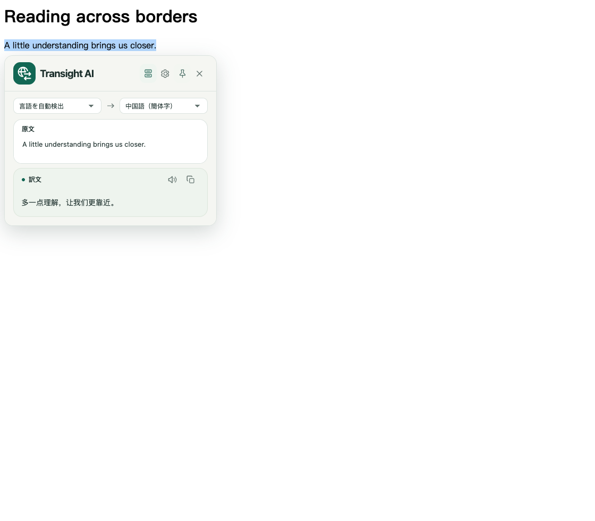
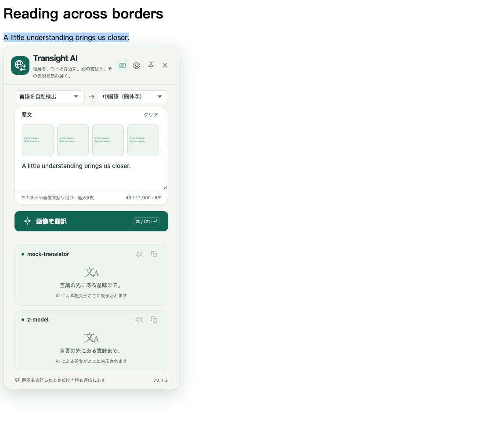
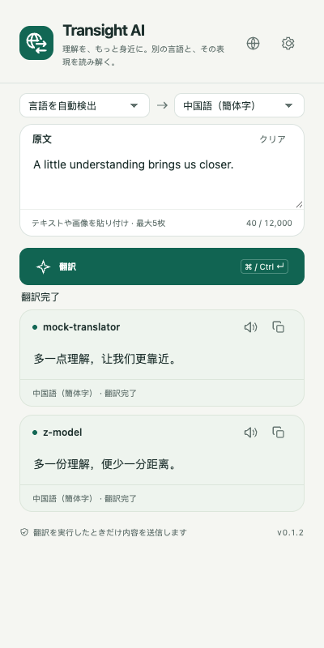
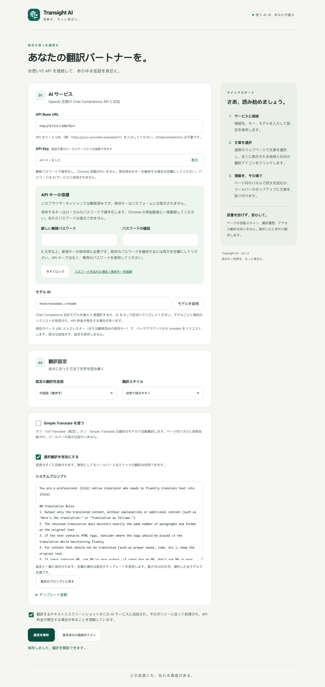
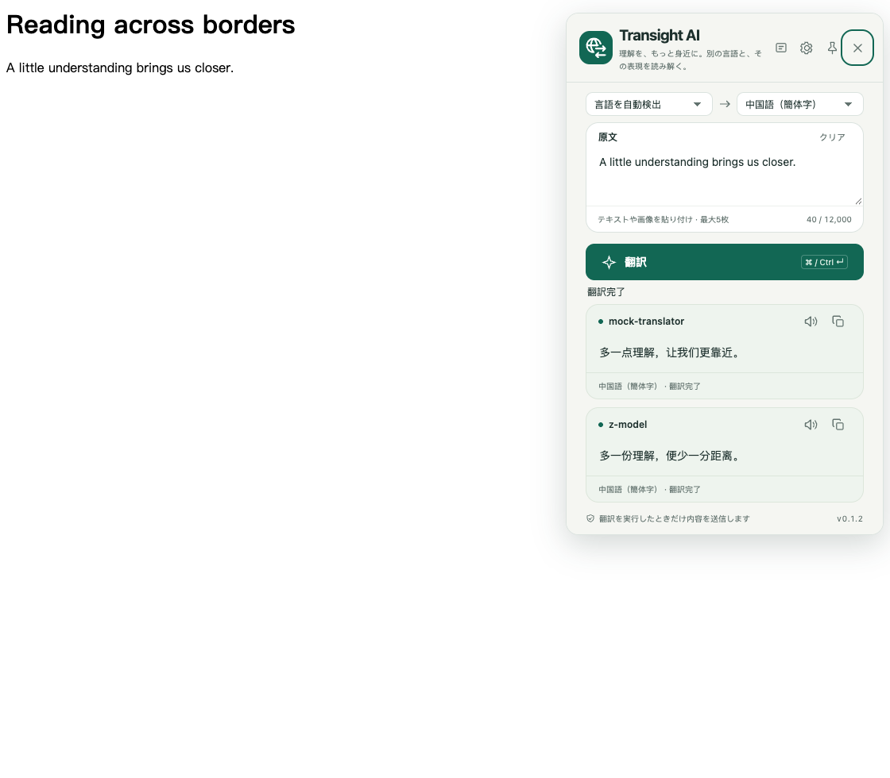
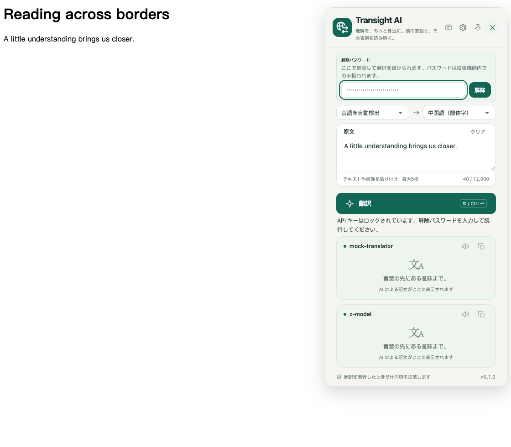

# Transight AI · 必要なときに翻訳

[简体中文](README.md) | [English](README.en.md) | **日本語** | [한국어](README.ko.md)

自分の AI サービスを使って文章を翻訳する Chrome 拡張機能です。**Manifest V3 と素の JavaScript / HTML / CSS** で構成され、実行時の外部依存や埋め込み API キーはありません。`npm run build` で開発者モード用の `dist/` を生成します。通常のビルドでは ZIP を作成しません。

**現在のバージョン：0.1.2**（2026-10-06）。ドキュメント・画面キャプチャ・ストア資料を更新しました。ストア用パッケージ：[`transight-0.1.2.zip`](chrome-web-store/package/transight-0.1.2.zip)。開発者モードでは引き続き `dist/` を読み込み、更新後は拡張機能と開いているウェブページを再読み込みしてください。

## 主な機能

- **5 言語の UI**：日本語、韓国語、英語、中国語（簡体字・繁体字）。既定ではブラウザーの UI 言語に合わせ、未対応の言語は英語で表示します。
- **ツールバー翻訳**：原文を入力・貼り付け、翻訳先を選択して翻訳。ページで選択した文章も取り込めますが、ポップアップを開くだけでは送信しません。
- **選択範囲の翻訳**：通常の HTTP/HTTPS ページで文章を選択し、選択範囲の末尾に表示される地球と矢印のアイコンをクリックします。選択だけでは AI に送信しません。アイコンは 2.5 秒後に消えます。
- **右クリック翻訳**：選択した文章を右クリックし、「選択した文章を Transight AI で翻訳」を選びます。ツールバーとページ内パネルで共通の UI を使用します。
- **複数モデルの比較**：モデル一覧から選ぶか ID をカンマ区切りで入力して、最大 5 モデルを同時に利用できます。各カードに独立した結果、コピー、エラー、再試行を表示します。
- **10 の翻訳先言語**：中国語（簡体字・繁体字）、英語、日本語、韓国語、フランス語、ドイツ語、スペイン語、ロシア語、ポルトガル語。
- **3 つの翻訳スタイル**：自然で読みやすく、原文に忠実に、専門的かつ正確に。
- **固定・移動できるパネル**：固定ボタンで今回のパネルを固定し、上部をドラッグして移動できます。1〜2 モデルでは内容に応じた高さ、3 モデル以上では最初の 2 件分を表示し、残りをスクロールします。
- **API キーの暗号化とその場での解除**：設定画面だけでなく、ポップアップやページ内パネルでも必要なときに解除できます。

### Simple Translate / Full Translate

設定の **Simple Translate を使う** は既定でオフ（**Full Translate**）です。オンにすると、選択・右クリック翻訳のパネルは**最初の選択モデルだけ**で自動翻訳します。原文言語（既定は自動検出）、翻訳先言語、編集可能な原文、訳文を表示し、翻訳ボタンは表示しません。言語を変更するか入力を約0.6秒停止すると再翻訳し、翻訳先は記憶されます。

上部から設定を開くか、アイコンで **Simple Translate / Full Translate** を切り替えられます。原文とモデル一覧は保持され、設定は即時保存・同期されます。ツールバーのポップアップは従来の表示です。再試行・認証エラーの設定リンク・インライン解除は維持し、コピー・読み上げは Simple モードでも利用できます。画像などの全機能は Full モードで利用できます。

#### 現在の操作

Full / Simple とも原文言語を選択でき、既定は自動検出です。モード変更時も原文と原文言語を保持します。翻訳先はポップアップ・パネル・設定で記憶・同期されます。Full はキャンセルボタン、Simple は文章・言語の変更で古いリクエストを中止します。表示言語はポップアップか設定で変更し、ページ内パネルには言語切り替えボタンを表示しません。パネルは保存済みの表示言語に従います。

## スクリーンショット・クリップボード画像の翻訳

ポップアップ上部のスクリーンショット入口（ハサミ・文字ボタン）は削除しました。**ここからページ内の範囲キャプチャは開始できません。** 内部のキャプチャ・切り抜き処理は残っていますが、現在の画面には入口がありません。OS のスクリーンショット機能で画像をコピーして貼り付けてください。

ツールバーポップアップまたは **Full Translate** パネルの原文欄で **Ctrl+V / Cmd+V** を押すと画像を貼り付けられます（Simple はテキストのみ）。最大 **5 枚**の **72 × 72 サムネイル**を左上に1行で表示し、横スクロールできます。文章は画像の下から入力します。画像にマウスを重ねるか削除ボタンにキーボードフォーカスを合わせると、小さい白地の **×** を表示します。1枚ずつ削除でき、「クリア」は文章と画像をすべて消去します。

原文言語と翻訳先を選び画像翻訳を実行すると、文章と画像を各モデルへ送信します。画像入力対応の Chat Completions 互換モデルが必要です。モデル自動変更や別の OCR サービスは使いません。PNG、JPEG、WebP、GIF、BMP を静止 JPEG に変換し、長辺最大2,048ピクセルに縮小します。SVG は非対応です。

**貼り付け・プレビューだけでは送信しません。** 翻訳、再試行、パネルの言語・モード変更により送信する場合があり、提供元の料金が発生する可能性があります。バックグラウンドでクリップボードを読み取らず、画像を local/session storage や履歴に保存しません。画像リクエストにページのタイトル・概要は付加しません。機密情報と翻訳精度を確認してください。

### 訳文の読み上げ

各モデルのコピーボタンの隣にあるスピーカーを押すと読み上げ、もう一度押すと停止します。自動再生はしません。他のモデルが翻訳中でも完了した訳文は読み上げられます。拡張機能全体で同時に再生するのは1件だけです。別のモデルやウィンドウで再生すると前の音声が停止します。画面を閉じる、ページを更新する、クリアする、再翻訳すると停止します。固定・移動・コピーでは停止しません。

Chrome の `tts` で、対象言語にかかわらずローカルの中国語音声を使います。zh-CN を優先し、なければ別の中国語音声を選びます。訳文自体は変更しません。長い訳文は分割して読み上げます。翻訳 API キーやクラウド音声サービスは使わず、音声や読み上げ用テキストを追加保存しません。ローカルの中国語音声がなければシステム設定からインストールしてください。リモート音声や中国語以外の音声には切り替えません。外国語の発音は中国語音声エンジンの対応状況に依存します。一時停止、速度・音声の選択、ダウンロードは未対応です。更新後は拡張機能とページを再読み込みしてください。

### 選択翻訳の切り替えとシステムプロンプト

設定で選択翻訳を有効・無効にできます（既定は有効）。変更は即座に保存され、開いているページにも反映されます。無効にするとアイコンと現在のパネルを閉じますが、ツールバーと右クリックによる翻訳は引き続き利用できます。

システムプロンプトを編集・既定に復元し、設定を保存して適用します。空欄は既定のテンプレートを使用します。最大16,000文字で、選択した全モデルに適用されます。テンプレートは `system`、原文は別の `user` メッセージとして送信します。

`{{text}}` は原文、`{{from}}` は Full / Simple モードで選択した原文言語（未指定時は自動検出）、`{{to}}` は翻訳先言語です。`{{title_prompt}}` はページタイトル、`{{summary_prompt}}` は既存の `description` メタデータ、`{{terms_prompt}}` は専門用語（用語集未設定時は空）、`{{imt_style_guide}}` は選択した翻訳スタイルです。

取得できない情報は空になります。既定のテンプレートではページのタイトルと概要も設定したサービスに送ります。不要な場合は対応する変数を削除してください。全文の収集や追加のAI要約は行わず、手動入力にはページ情報を付けません。プロンプトはローカル保存されるため、認証情報は記入しないでください。

### Simple モードと画像入力

編集可能な原文、言語選択、コピー、読み上げを備えた Simple モード。



Full モード：画像を1行で表示し、その下に文章を入力。



## スクリーンショット

実際の日本語 UI をローカルのテストサービスで撮影しています。訳文とモデル名はテスト例であり、実際のモデルの品質を示すものではありません。

| 複数モデルの翻訳 | サービスとキーの設定 |
| --- | --- |
|  |  |

ページ内での翻訳：



パネルを閉じずに解除：



## 1. ビルドとインストール

Node.js 20 以降が必要です。通常のビルドに依存パッケージのインストールは不要です。

```sh
npm run build
```

1. Chrome で `chrome://extensions` を開きます。
2. **デベロッパー モード**を有効にします。
3. **パッケージ化されていない拡張機能を読み込む**を選択します。
4. プロジェクトのルートではなく、生成された **`dist/`** を選択します。
5. 拡張機能メニューで **Transight AI** をツールバーに固定します。

最低 Chrome バージョンは 114 です。コード変更後は再ビルドし、拡張機能を再読み込みしてください。既にパネルを表示したウェブページも再読み込みしてください。

## 2. 表示言語

設定ボタンの隣にある**地球アイコン**から「ブラウザーに合わせる / 简体中文 / 繁體中文 / English / 日本語 / 한국어」を選べます。

- `ja` / `ja-JP` は日本語、`ko` / `ko-KR` は韓国語です。
- `zh-CN` / `zh-SG` / `zh-Hans` は簡体字、`zh-TW` / `zh-HK` / `zh-MO` / `zh-Hant` は繁体字です。明示された `Hans` / `Hant` は地域より優先されます。
- それ以外は英語にフォールバックします。ページ本文の言語ではなく、Chrome の UI 言語を参照します。
- 手動選択は保存され、ポップアップ、開いている設定画面、右クリックメニュー、ページ内パネルに反映されます。原文、訳文、未保存の設定は維持されます。
- **表示言語と翻訳先言語は別の設定です。** 表示言語を変えてもモデルや翻訳先は変わりません。
- Chrome の拡張機能管理画面に表示する名前・説明はブラウザーの言語に従います。

## 3. AI サービスの設定

ポップアップ右上の設定ボタンを開きます。

| 項目 | 入力する内容 |
| --- | --- |
| API Base URL | `https://your-provider.example/v1` などの API ベース URL。サービスのホームページではありません |
| API Key | サービス側で発行したキー。認証不要のローカルサービスでは空欄にできます |
| モデル ID | Chat Completions 対応モデルを 1〜5 個選択、またはカンマ区切りで手入力 |
| 既定の翻訳先言語 | ツールバーの初期値および右クリック翻訳の翻訳先 |
| 翻訳スタイル | 新しい翻訳リクエストに適用するスタイル |

テキスト送信・料金に関する確認に同意して保存してください。接続テストは選択した各モデルに `Hello, world!` を送信するため、料金が発生する場合があります。

「モデルを取得」は現在の URL と入力したキー、または解除済みの保存キーを使って `GET /models` を呼び出します。原文は送信せず、設定も自動保存しません。サービスが一覧取得に対応していない場合は ID を手入力できます。API は `POST /chat/completions` 互換である必要があります。HTTP は `localhost` / `127.0.0.1` のみ許可し、その他は HTTPS が必要です。

### キーと解除パスワード

新しい API キーを保存するときは、**6 文字以上**の専用パスワードと確認用パスワードを入力します。API キー自体をパスワードにしないでください。保存済みのキーやパスワードを維持する場合は該当欄を空欄にします。

- Chrome の再起動や拡張機能の再読み込み・更新後は再度解除が必要です。
- ポップアップやページ内パネルに解除フォームが表示されたら、その場で入力できます。解除後、待機中の翻訳や単独の再試行が続行されます。
- 設定画面からいつでもロックできます。パスワードを忘れた場合は復元できません。保存キーを削除して API キーを入力し直します。他の設定は保持されます。
- 旧版の平文キーがある場合は、設定でパスワードを設定して保存してください。暗号化が成功するまでは翻訳・モデル取得が停止されます。

## 翻訳の操作と制限

原文は最大 12,000 文字です。翻訳ボタンまたは `Ctrl/⌘ + Enter` で送信できます。各モデルのコピーアイコンは成功時にチェックマークとなり、1.5 秒後に戻ります。失敗したカードの「再試行」は、そのモデルだけを再試行します。翻訳中のパネルで翻訳先を変更すると、新しいリクエストが送信されます。

パネルは幅 400px を基本とし、狭い画面では縮小します。固定していないパネルは外側のクリックでも閉じます。固定後は上部をドラッグ、または上部にフォーカスして矢印キー（Shift で大きく移動）を使えます。閉じるボタンと Esc は常に利用でき、固定状態は次回へ引き継ぎません。

通常の HTTP/HTTPS ページではサイトごとの初期設定は不要ですが、Chrome 側のサイトアクセス制限は適用されます。入力欄、パスワード欄、編集領域では選択アイコンを表示しません。Chrome 内部ページ、Chrome Web Store、PDF ビューアーなどでは制限があります。右クリックでパネルを挿入できない場合は独立ウィンドウに選択内容を渡し、翻訳ボタンで続行します。

## プライバシーとセキュリティ

- API キーは **AES-256-GCM** と **PBKDF2-SHA-256（600,000 回）** で暗号化し、`chrome.storage.local` に保存します。ランダムなソルトと毎回新しい IV を使用します。パスワード・派生キーは保存せず、Chrome 同期も行いません。
- 解除後の API キーは、信頼された拡張機能コンテキストに限定した `chrome.storage.session` に一時保持します。ロックやセッション終了で削除されます。これはロック中の保存データを保護するもので、侵害されたブラウザーや端末から完全に保護するものではありません。
- 通信はバックグラウンドで行い、翻訳する文章と認証用 API キーを設定した AI サービスへ送ります。解除パスワードは送信しません。Cookie を付けず、リダイレクトも追従しません。
- ページ全体の自動アップロード、永続的な翻訳履歴、アクセス解析はありません。接続テストやモデル取得も設定したサービスと通信します。
- 訳文はプレーンテキストとして表示し、HTML や Markdown を実行しません。ページ内パネルは機密情報を安全に表示するための隔離環境ではありません。
- 送信した内容にはサービス提供者のポリシーが適用されます。機密情報の送信を避け、料金上限と最小権限のキーを使用してください。AI の訳文は誤ることがあるため、重要な情報は確認してください。

| 権限 | 用途 |
| --- | --- |
| `storage` | 設定、暗号化キー、解除セッション、制限ページの一時的な選択内容 |
| `contextMenus` | 右クリック翻訳 |
| `activeTab` | ユーザー操作後に現在のページの選択範囲・関連情報を読み取り。撮影処理は残っていますが、UI の撮影入口はありません |
| `scripting` | 選択内容の取得とパネルの挿入 |
| `tts` | ユーザー操作でローカル音声による読み上げ・停止を行う |
| HTTP/HTTPS のホスト権限 | 選択翻訳と設定した API への通信。インストール時に全サイトへのアクセス警告が表示される場合があります |

## 開発・テスト

```sh
npm run check
npm test
npm run build
# Playwright と対応する Chromium が必要です
TEST_BROWSER_LOCALE=ja-JP npm run test:browser
TEST_BROWSER_LOCALE=ko-KR npm run test:browser
TEST_BROWSER_LOCALE=en-US npm run test:browser
TEST_BROWSER_LOCALE=zh-CN npm run test:browser
TEST_BROWSER_LOCALE=zh-TW npm run test:browser
TEST_BROWSER_LOCALE=fr-FR npm run test:browser # 英語へのフォールバック
```

ブラウザーテストは一時プロファイルとローカルの模擬 API を使用します。実際の API キーは不要です。画像は `artifacts/screenshots/<locale>/` に保存され、`dist/` には入りません。実サービス、通常の Chrome での権限確認、制限ページは別途手動確認が必要です。詳細なテスト環境設定は [英語 README](README.en.md#development-and-testing) を参照してください。

主な構成：`_locales/{en,zh_CN,zh_TW,ja,ko}/` は文言、`src/shared/` は共通 UI と通信処理、`src/popup/` はポップアップ、`src/options/` は設定、`src/unlock/` は解除フォーム、`src/content/` は選択翻訳、`tests/` と `scripts/` は検証とビルドです。

## Chrome Web Store

[商店提出用フォルダー](chrome-web-store/README.md) に 5 言語の説明・各言語 5 枚のスクリーンショット、アイコン、共通の宣伝画像をまとめています。`npm run package` で `chrome-web-store/package/` の ZIP を更新します。通常の `npm run build` は引き続き `dist/` のみを生成します。公開や審査への提出は自動では行いません。

未実装：ページ全体の対訳、ストリーミング、翻訳履歴、発音記号、単語帳、アカウント・課金管理。API キーや翻訳クレジットは付属しません。

## ライセンス

[Apache License 2.0](LICENSE) に基づくオープンソースです。別途記載がない限り、拡張機能・ウェブサイトのソース、ドキュメント、オリジナル素材に適用されます。第三者の依存関係や素材には各自のライセンスが適用されます。
