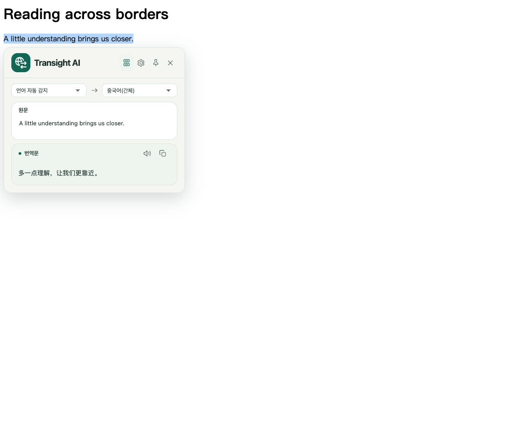
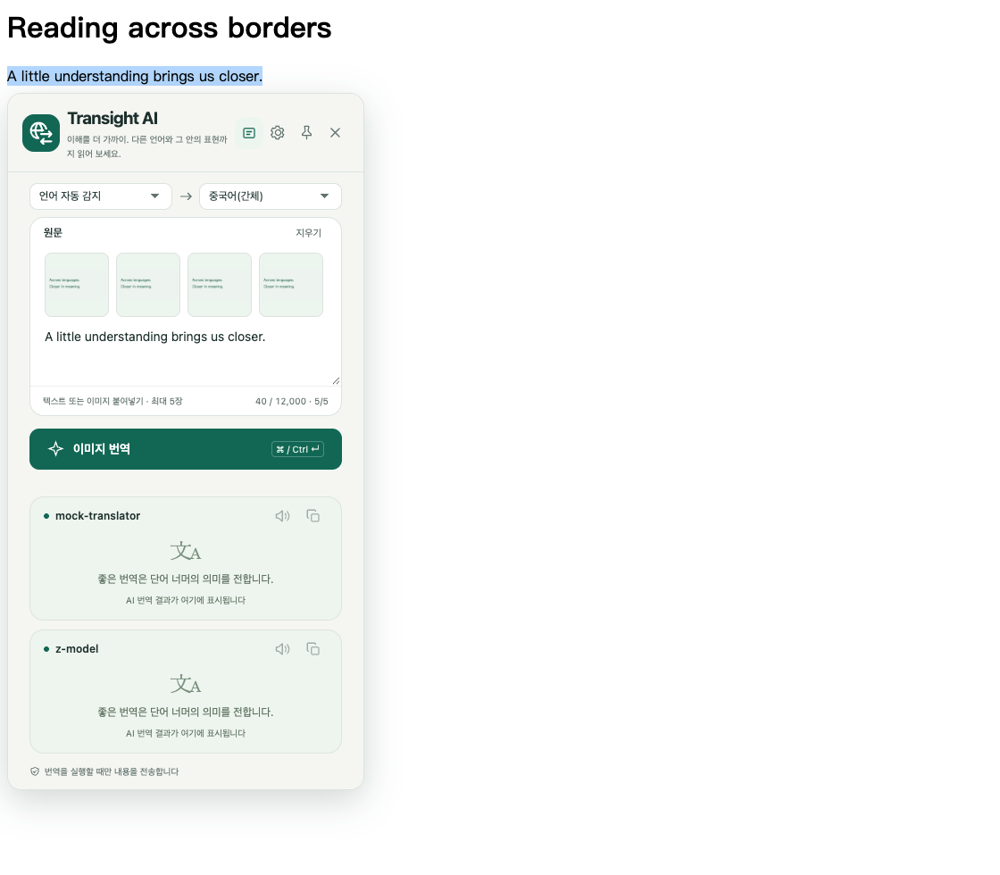
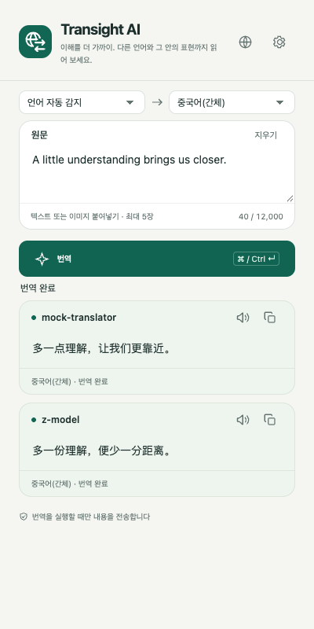
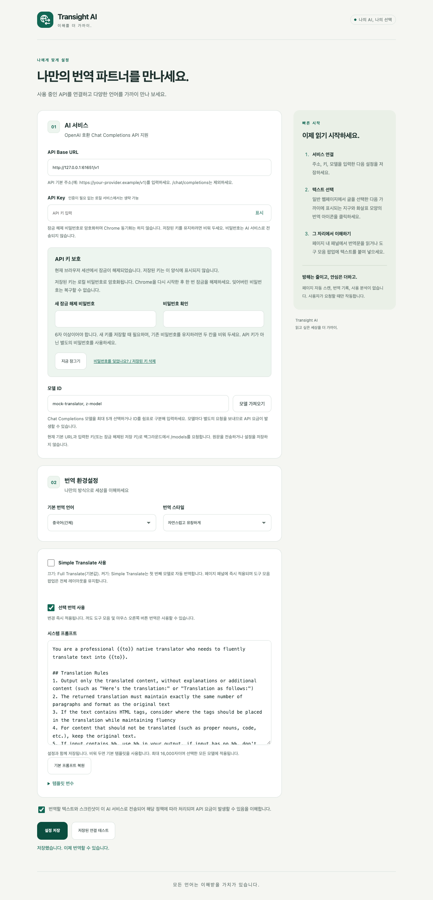
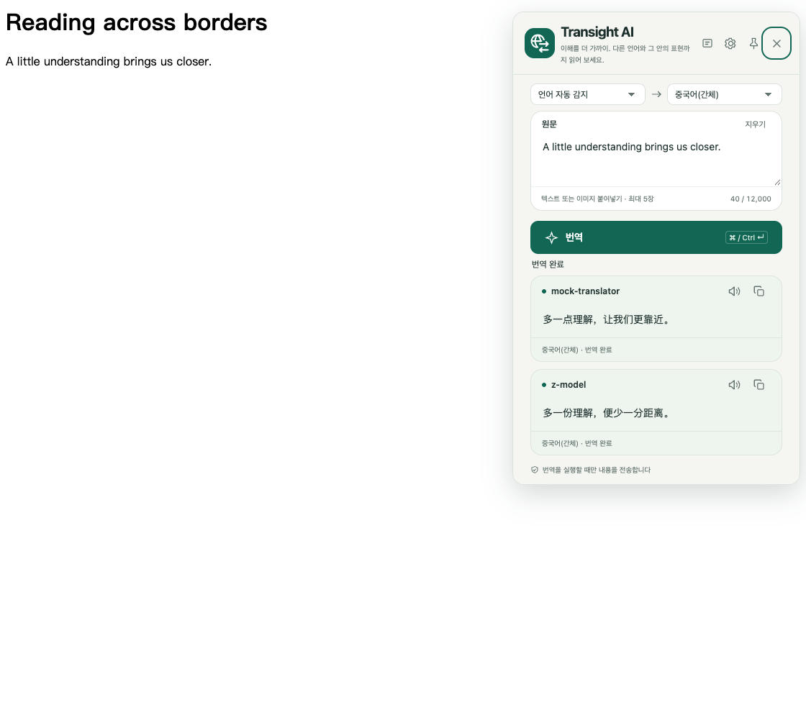
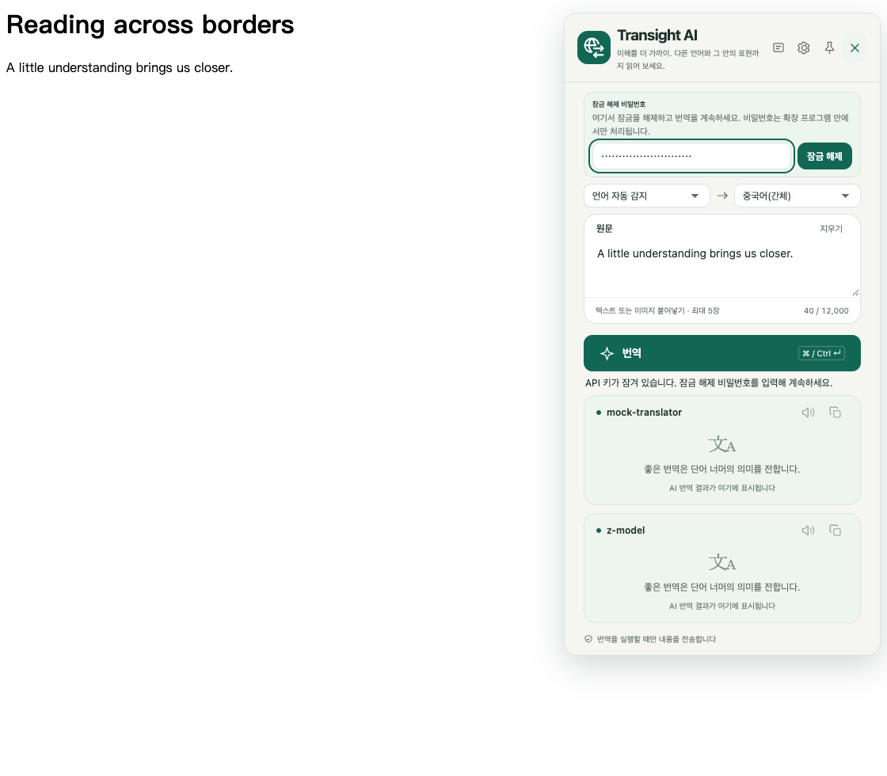

# Transight AI · 필요할 때 바로 번역

[简体中文](README.md) | [English](README.en.md) | [日本語](README.ja.md) | **한국어**

직접 선택한 AI 서비스로 텍스트를 번역하는 Chrome 확장 프로그램입니다. **Manifest V3와 순수 JavaScript / HTML / CSS**로 구현했으며, 런타임 외부 의존성이나 내장 API 키가 없습니다. `npm run build`로 개발자 모드에서 불러올 `dist/`를 생성합니다. 일반 빌드는 ZIP을 만들지 않습니다.

**현재 버전: 0.1.3** (2026-10-09). 문서, UI 스크린샷, 스토어 자료를 동기화했습니다. 스토어 패키지: [`transight-0.1.3.zip`](chrome-web-store/package/transight-0.1.3.zip). 개발자 모드에서는 계속 `dist/`를 로드하고, 업데이트 후 확장 프로그램과 열려 있는 웹페이지를 새로고침하세요.

## 주요 기능

- **5개 UI 언어**: 한국어, 일본어, 영어, 중국어 간체·번체. 기본적으로 브라우저 UI 언어를 따르며, 지원하지 않는 언어는 영어로 표시합니다.
- **도구 모음 번역**: 원문 입력·붙여넣기, 번역 언어 선택, 번역 및 복사. 페이지에서 선택한 텍스트도 가져올 수 있지만 팝업을 여는 것만으로 전송하지는 않습니다.
- **선택한 텍스트 번역**: 일반 HTTP/HTTPS 페이지에서 글을 선택한 다음, 선택 영역 끝에 나타나는 지구와 화살표 아이콘을 클릭하세요. 선택만으로 AI 요청을 보내지 않으며 아이콘은 2.5초 후 사라집니다.
- **우클릭 번역**: 선택한 글을 우클릭한 뒤 “선택한 텍스트를 Transight AI로 번역”을 선택하세요. 도구 모음과 페이지 내 패널은 같은 번역 UI를 사용합니다.
- **여러 모델 비교**: 목록에서 선택하거나 쉼표로 구분한 ID를 입력하여 최대 5개 모델을 동시에 사용합니다. 모델마다 독립적인 결과, 복사, 오류, 다시 시도 기능을 제공합니다.
- **10개 번역 언어**: 중국어 간체·번체, 영어, 일본어, 한국어, 프랑스어, 독일어, 스페인어, 러시아어, 포르투갈어.
- **3가지 번역 스타일**: 자연스럽고 유창하게, 원문에 충실하게, 전문적이고 정확하게.
- **고정·이동 가능한 패널**: 고정 버튼을 누른 뒤 상단을 드래그해 이동합니다. 모델이 1~2개면 내용에 맞게 높이가 조절되고, 3개 이상이면 처음 두 결과를 표시하며 나머지는 스크롤로 확인합니다.
- **API 키 암호화 및 바로 잠금 해제**: 설정뿐 아니라 팝업과 페이지 내 패널에서도 필요할 때 비밀번호를 입력할 수 있습니다.

### Simple Translate / Full Translate

설정의 **Simple Translate 사용**은 기본적으로 꺼져 있습니다(**Full Translate**). 켜면 선택·우클릭 번역 패널은 **첫 번째 선택 모델만** 사용해 자동 번역합니다. 원문 언어(기본값: 자동 감지), 대상 언어, 편집 가능한 원문, 번역문만 표시하며 번역 버튼은 없습니다. 언어를 바꾸거나 입력을 약 0.6초 멈추면 다시 번역하고 대상 언어를 기억합니다.

상단에서 설정을 열거나 아이콘으로 **Simple Translate / Full Translate**를 전환할 수 있습니다. 원문과 선택 모델은 유지되며 모드는 즉시 저장·동기화됩니다. 도구 모음 팝업은 전체 레이아웃을 유지합니다. 재시도·인증 오류 설정 링크·인라인 잠금 해제는 지원하며 복사·음성 기능은 Simple 모드에서도 지원합니다. 이미지 등 전체 기능은 Full 모드를 사용하세요.

#### 현재 조작 방식

Full / Simple 모두 원문 언어를 선택할 수 있으며 기본값은 자동 감지입니다. 모드를 바꿔도 원문과 선택 언어를 유지합니다. 대상 언어는 팝업·패널·설정 간에 기억·동기화됩니다. Full은 취소 버튼을 제공하고 Simple은 텍스트·언어를 바꾸면 이전 요청을 취소합니다. 표시 언어는 팝업 또는 설정에서 바꾸며 웹페이지 패널에는 언어 전환 버튼을 표시하지 않습니다. 패널은 저장된 표시 언어를 따릅니다.

## 스크린샷 및 클립보드 이미지 번역

팝업 상단의 스크린샷 진입 버튼(가위 아이콘 및 텍스트)을 제거했습니다. **현재 팝업에서 웹페이지 영역 캡처를 시작할 수 없습니다.** 내부 캡처·자르기 코드는 남아 있지만 사용자 화면에는 진입점이 없습니다. 운영체제 스크린샷 도구로 이미지를 복사한 뒤 붙여넣으세요.

도구 모음 팝업 또는 **Full Translate** 패널의 원문 입력란에서 **Ctrl+V / Cmd+V**로 이미지를 붙여넣습니다(Simple은 텍스트만 지원). 최대 **5장**, **72 × 72 썸네일**을 왼쪽 위 한 줄에 표시하고 넘치면 가로 스크롤합니다. 텍스트는 이미지 바로 아래에서 입력합니다. 마우스를 올리거나 삭제 버튼에 키보드 포커스를 두면 작은 흰색 **×**가 나타납니다. 개별 이미지를 삭제하거나 **지우기**로 텍스트와 이미지를 함께 지울 수 있습니다.

원문·대상 언어를 선택하고 이미지 번역을 실행하면 텍스트와 이미지를 각 모델로 보냅니다. 이미지 입력을 지원하는 Chat Completions 호환 모델이 필요하며 모델 자동 변경이나 별도 OCR은 사용하지 않습니다. PNG, JPEG, WebP, GIF, BMP를 정적 JPEG로 변환하며 긴 변은 최대 2,048픽셀입니다. SVG는 지원하지 않습니다.

**붙여넣기와 미리보기만으로 업로드하지 않습니다.** 번역·재시도 및 패널의 언어·모드 변경은 요청을 보낼 수 있으며 서비스 요금이 발생할 수 있습니다. 백그라운드 클립보드 접근이나 읽기 권한은 사용하지 않고 이미지를 local/session storage 또는 영구 기록에 저장하지 않습니다. 이미지 요청에는 페이지 제목·요약을 추가하지 않습니다. 민감한 정보와 번역 정확성을 확인하세요.

### 번역문 음성 읽기

각 모델 카드의 복사 버튼 옆 스피커를 누르면 읽기를 시작하고, 다시 누르면 중지합니다. 자동 재생하지 않으며 다른 모델이 번역 중이어도 완료된 결과를 읽을 수 있습니다. 확장 프로그램 전체에서 한 번에 하나만 재생합니다. 다른 모델이나 창에서 재생하면 이전 재생은 중지합니다. 창 닫기, 페이지 새로고침, 지우기, 재번역 시 중지하며 고정·이동·복사는 재생을 방해하지 않습니다.

Chrome `tts`에서 대상 언어와 관계없이 로컬 중국어 음성을 사용합니다. zh-CN을 우선하고 없으면 다른 중국어 음성을 선택합니다. 번역문 자체는 변경하지 않습니다. 긴 번역문은 나누어 읽습니다. 번역 API 키나 클라우드 음성 서비스를 사용하지 않고 음성이나 읽기용 텍스트를 추가 저장하지 않습니다. 로컬 중국어 음성이 없으면 시스템 설정에서 설치하도록 안내하며 원격 또는 중국어 이외의 음성으로 대체하지 않습니다. 외국어 발음은 중국어 음성 엔진의 지원에 따라 달라집니다. 일시 정지, 속도·음색 선택, 다운로드는 제공하지 않습니다. 업데이트 후 확장 프로그램과 웹페이지를 새로고침하세요.

### 선택 번역 전환 및 사용자 지정 시스템 프롬프트

설정에서 선택 번역을 켜거나 끌 수 있습니다(기본값: 켜짐). 변경 사항은 즉시 저장되고 열린 페이지에 반영됩니다. 끄면 아이콘과 현재 패널이 닫히지만 도구 모음과 오른쪽 클릭 번역은 계속 사용할 수 있습니다.

시스템 프롬프트를 편집하거나 기본값으로 복원한 뒤 설정을 저장하세요. 비워 두면 기본 템플릿을 사용합니다. 최대 16,000자로 선택한 모든 모델에 적용됩니다. 템플릿은 `system` 메시지로, 원문은 별도의 `user` 메시지로 전송됩니다.

`{{text}}`는 원문, `{{from}}`은 Full / Simple 모드에서 선택한 원문 언어(미지정 시 자동 감지), `{{to}}`는 대상 언어입니다. `{{title_prompt}}`는 페이지 제목, `{{summary_prompt}}`는 기존 `description` 메타데이터, `{{terms_prompt}}`는 전문 용어(용어집 미설정 시 비어 있음), `{{imt_style_guide}}`는 선택한 번역 스타일입니다.

없는 정보는 비워집니다. 기본 템플릿은 페이지 제목과 요약도 설정한 서비스로 보냅니다. 필요하지 않으면 해당 변수를 삭제하세요. 전체 페이지 수집이나 추가 AI 요약은 하지 않으며 수동 입력에는 페이지 정보를 붙이지 않습니다. 프롬프트는 로컬에 저장되므로 인증 정보를 입력하지 마세요.

### Simple 모드와 이미지 입력

원문 편집, 언어 선택, 복사와 음성 읽기를 지원하는 Simple 모드.



Full 모드: 한 줄 썸네일과 그 아래 텍스트 입력.



## 스크린샷

실제 한국어 UI를 로컬 테스트 서비스로 촬영했습니다. 번역문과 모델 이름은 테스트 예시이며 실제 모델의 품질을 의미하지 않습니다.

| 여러 모델 번역 | 서비스 및 키 설정 |
| --- | --- |
|  |  |

페이지 내 번역:



패널을 닫지 않고 잠금 해제:



## 1. 빌드 및 설치

Node.js 20 이상이 필요합니다. 일반 빌드에는 의존성 설치가 필요하지 않습니다.

```sh
npm run build
```

1. Chrome에서 `chrome://extensions`를 엽니다.
2. **개발자 모드**를 켭니다.
3. **압축해제된 확장 프로그램을 로드합니다**를 선택합니다.
4. 프로젝트 루트가 아닌, 생성된 **`dist/` 디렉터리**를 선택합니다.
5. 확장 프로그램 메뉴에서 **Transight AI**를 도구 모음에 고정합니다.

최소 Chrome 버전은 114입니다. 코드를 변경하면 다시 빌드하고 확장 프로그램을 새로고침하세요. 이미 번역 패널을 삽입한 웹페이지도 새로고침해야 합니다.

## 2. 표시 언어

설정 버튼 옆의 **지구 아이콘**에서 “브라우저 언어 따르기 / 简体中文 / 繁體中文 / English / 日本語 / 한국어”를 선택할 수 있습니다.

- `ko` / `ko-KR`은 한국어, `ja` / `ja-JP`는 일본어로 표시합니다.
- `zh-CN` / `zh-SG` / `zh-Hans`는 간체, `zh-TW` / `zh-HK` / `zh-MO` / `zh-Hant`는 번체로 표시합니다. 명시된 `Hans` / `Hant` 태그가 지역보다 우선합니다.
- 나머지 언어는 영어로 표시합니다. 웹페이지 언어가 아니라 Chrome UI 언어를 따릅니다.
- 수동 선택은 저장되며 팝업, 열린 설정 화면, 우클릭 메뉴, 페이지 내 패널에 반영됩니다. 원문, 번역문, 저장하지 않은 설정은 유지됩니다.
- **표시 언어와 번역 대상 언어는 별개입니다.** 표시 언어를 바꿔도 모델이나 번역 대상은 바뀌지 않습니다.
- Chrome 확장 프로그램 관리 화면의 이름과 설명은 브라우저 언어를 따릅니다.

## 3. AI 서비스 설정

팝업 오른쪽 위의 설정 버튼을 여세요.

| 항목 | 입력 내용 |
| --- | --- |
| API Base URL | `https://your-provider.example/v1`과 같은 API 기본 URL. 제공업체 홈페이지 주소가 아닙니다 |
| API Key | 제공업체가 발급한 키. 인증 없는 로컬 서비스라면 비워 둘 수 있습니다 |
| 모델 ID | Chat Completions 지원 모델 1~5개를 선택하거나 쉼표로 구분해 직접 입력 |
| 기본 번역 언어 | 도구 모음 초기값 및 우클릭 번역의 대상 언어 |
| 번역 스타일 | 새 번역 요청에 적용할 스타일 |

텍스트 전송 및 요금 안내에 동의한 후 저장하세요. 연결 테스트는 선택한 각 모델에 `Hello, world!`를 보내므로 API 요금이 발생할 수 있습니다.

“모델 가져오기”는 현재 URL과 입력한 키 또는 잠금 해제된 저장 키를 이용해 `GET /models`를 호출합니다. 원문을 보내거나 설정을 자동 저장하지 않습니다. 목록 조회를 지원하지 않는 서비스는 ID를 직접 입력할 수 있습니다. API는 `POST /chat/completions`와 호환되어야 합니다. HTTP는 `localhost` / `127.0.0.1`에서만 허용되며, 그 외에는 HTTPS가 필요합니다.

### 키와 잠금 해제 비밀번호

새 API 키를 저장할 때 **6자 이상**의 별도 비밀번호와 확인 비밀번호를 입력하세요. API 키 자체를 비밀번호로 사용하지 마세요. 기존 키나 비밀번호를 유지하려면 해당 칸을 비워 두세요.

- Chrome 재시작 또는 확장 프로그램 재로드·업데이트 후에는 다시 잠금을 해제해야 합니다.
- 팝업이나 페이지 내 패널에 잠금 해제 양식이 나타나면 바로 입력할 수 있습니다. 해제 후 대기 중인 번역이나 개별 모델 재시도가 이어집니다.
- 설정에서 언제든 잠글 수 있습니다. 잊어버린 비밀번호는 복구할 수 없습니다. 저장된 키를 삭제한 다음 API 키를 다시 입력하세요. 다른 설정은 유지됩니다.
- 이전 버전의 평문 키가 있으면 설정에서 비밀번호를 지정하고 저장하세요. 암호화가 완료될 때까지 번역 및 모델 요청은 차단됩니다.

## 번역 조작 및 제한

원문은 최대 12,000자입니다. 번역 버튼 또는 `Ctrl/⌘ + Enter`로 전송할 수 있습니다. 모델별 복사 아이콘은 복사 성공 시 체크 표시로 바뀌고 1.5초 후 돌아옵니다. 실패한 카드의 “다시 시도”는 해당 모델만 재시도합니다. 활성 번역 패널에서 번역 대상 언어를 바꾸면 새 요청이 전송됩니다.

패널의 기본 너비는 400px이며 좁은 화면에서는 줄어듭니다. 고정하지 않은 패널은 바깥쪽을 클릭해도 닫힙니다. 고정 후에는 상단을 드래그하거나 상단에 포커스를 두고 방향키로 이동할 수 있습니다(Shift를 누르면 더 크게 이동). 닫기 버튼과 Esc는 항상 사용할 수 있으며 고정 상태는 다음 패널까지 유지하지 않습니다.

일반 HTTP/HTTPS 페이지는 사이트별 초기 설정이 필요 없지만 Chrome의 사이트 접근 제한은 적용됩니다. 입력란, 비밀번호란, 편집 영역에서는 선택 아이콘을 표시하지 않습니다. Chrome 내부 페이지, Chrome Web Store, PDF 뷰어 등에는 제한이 있습니다. 우클릭 패널을 삽입할 수 없으면 별도 창으로 선택 내용을 전달하며, 번역 버튼으로 계속할 수 있습니다.

## 개인정보 및 보안

- API 키를 **AES-256-GCM**과 **PBKDF2-SHA-256(600,000회)**으로 암호화하여 `chrome.storage.local`에 저장합니다. 무작위 솔트와 매번 새로운 IV를 사용합니다. 비밀번호와 파생 키는 저장하지 않으며 Chrome 동기화도 하지 않습니다.
- 잠금 해제된 API 키는 신뢰할 수 있는 확장 프로그램 컨텍스트로 제한된 `chrome.storage.session`에 임시 보관합니다. 잠금 또는 세션 종료 시 제거됩니다. 이는 잠긴 상태의 저장 데이터를 보호하는 것이며, 침해된 브라우저나 기기를 완전히 보호하지는 못합니다.
- 네트워크 요청은 백그라운드에서 처리하며 번역할 텍스트와 인증용 API 키를 사용자가 설정한 AI 서비스로 보냅니다. 잠금 해제 비밀번호는 보내지 않습니다. 브라우저 쿠키를 포함하지 않고 리디렉션을 따르지 않습니다.
- 전체 페이지 자동 업로드, 영구 번역 기록, 사용 분석은 없습니다. 연결 테스트와 모델 조회도 설정한 서비스에 접속합니다.
- 번역문은 일반 텍스트로 표시하며 HTML이나 Markdown을 실행하지 않습니다. 페이지 내 패널은 기밀 정보를 안전하게 표시하기 위한 격리 환경이 아닙니다.
- 전송한 내용에는 제공업체 정책이 적용됩니다. 민감한 정보 전송을 피하고 사용 한도 및 최소 권한 키를 활용하세요. AI 번역에는 오류가 있을 수 있으므로 중요한 정보는 확인하세요.

| 권한 | 용도 |
| --- | --- |
| `storage` | 설정, 암호화된 키, 잠금 해제 세션, 제한 페이지의 임시 선택 내용 |
| `contextMenus` | 우클릭 번역 |
| `activeTab` | 사용자 동작 후 현재 페이지 선택 영역과 관련 정보를 읽음. 캡처 처리는 남아 있지만 UI 진입점은 없음 |
| `scripting` | 선택 내용 읽기 및 패널 삽입 |
| `tts` | 사용자 요청 시 로컬 음성으로 번역문 읽기 및 중지 |
| HTTP/HTTPS 호스트 권한 | 선택 번역 및 설정한 API 통신. 설치 시 모든 사이트 접근 경고가 표시될 수 있습니다 |

## 개발 및 테스트

```sh
npm run check
npm test
npm run build
# Playwright 및 호환되는 Chromium 필요
TEST_BROWSER_LOCALE=ko-KR npm run test:browser
TEST_BROWSER_LOCALE=ja-JP npm run test:browser
TEST_BROWSER_LOCALE=en-US npm run test:browser
TEST_BROWSER_LOCALE=zh-CN npm run test:browser
TEST_BROWSER_LOCALE=zh-TW npm run test:browser
TEST_BROWSER_LOCALE=fr-FR npm run test:browser # 영어 대체 표시 검증
```

브라우저 테스트는 임시 프로필과 로컬 모의 API를 사용하며 실제 API 키는 필요하지 않습니다. 스크린샷은 `artifacts/screenshots/<locale>/`에 저장되고 `dist/`에는 들어가지 않습니다. 실제 서비스, 일반 Chrome의 권한 안내, 제한 페이지는 별도 수동 확인이 필요합니다. 테스트 환경 설정은 [영문 README](README.en.md#development-and-testing)를 참고하세요.

주요 구조: `_locales/{en,zh_CN,zh_TW,ja,ko}/`는 번역 문구, `src/shared/`는 공통 UI와 통신 처리, `src/popup/`은 팝업, `src/options/`는 설정, `src/unlock/`은 잠금 해제 양식, `src/content/`는 선택 번역, `tests/`와 `scripts/`는 검증 및 빌드입니다.

## Chrome Web Store

[스토어 제출 폴더](chrome-web-store/README.md)에 5개 언어의 설명, 언어별 스크린샷 5장, 아이콘, 공용 홍보 이미지를 준비했습니다. `npm run package`로 `chrome-web-store/package/`의 ZIP을 갱신합니다. 일반 `npm run build`는 계속해서 `dist/`만 생성합니다. 스토어 게시나 심사 제출은 자동으로 수행하지 않습니다.

미구현 기능: 전체 페이지 병렬 번역, 스트리밍 출력, 번역 기록, 발음 기호, 단어장, 계정·결제 관리. API 키나 번역 크레딧은 포함하지 않습니다.

## 라이선스

[Apache License 2.0](LICENSE) 기반 오픈 소스입니다. 별도 표시가 없으면 확장 프로그램·웹사이트 소스, 문서, 원본 에셋에 적용됩니다. 타사 의존성과 에셋에는 각각의 라이선스가 적용됩니다.
