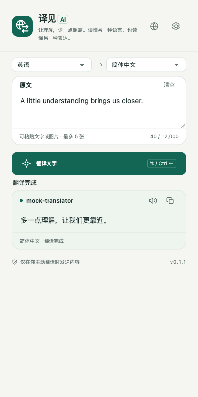
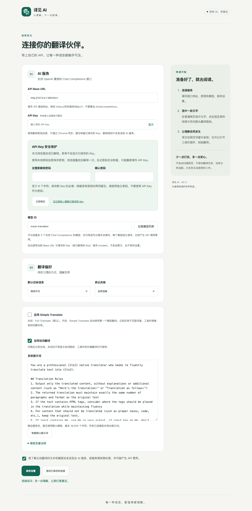
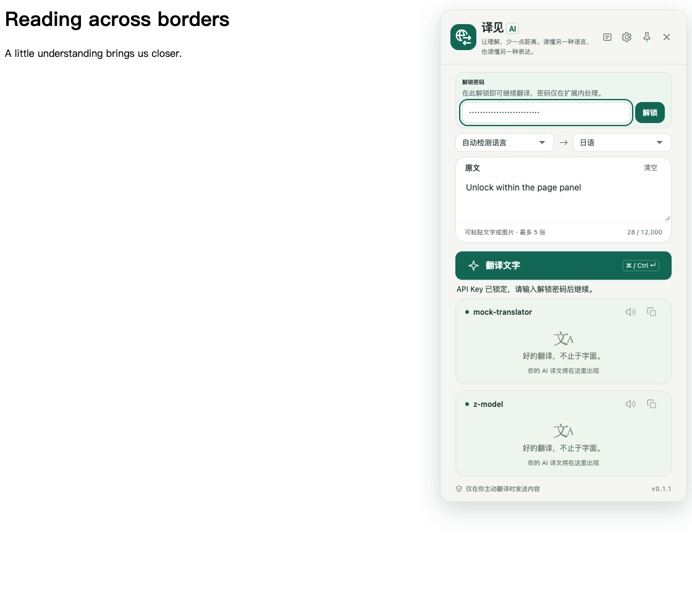
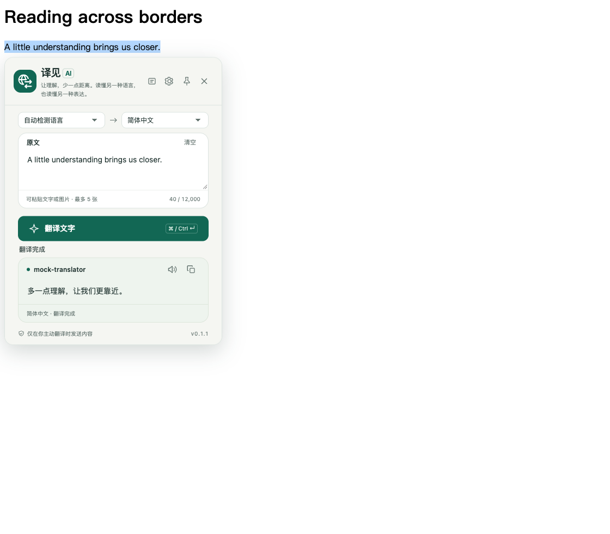
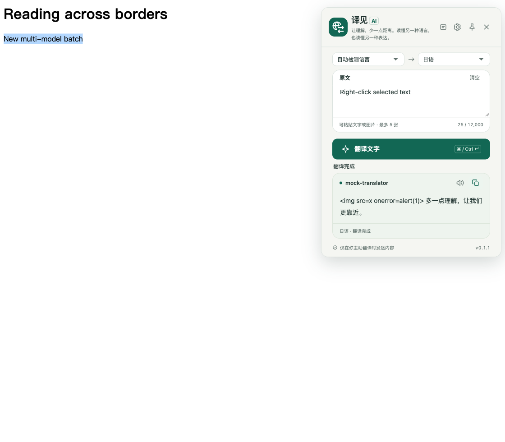
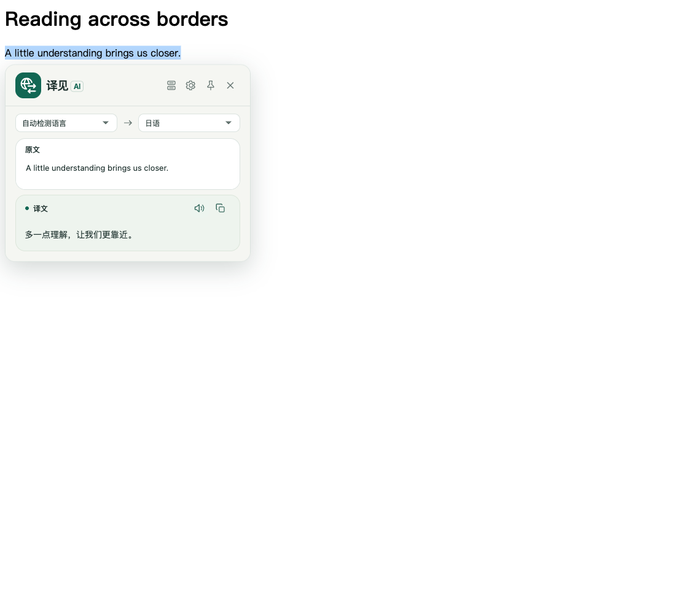
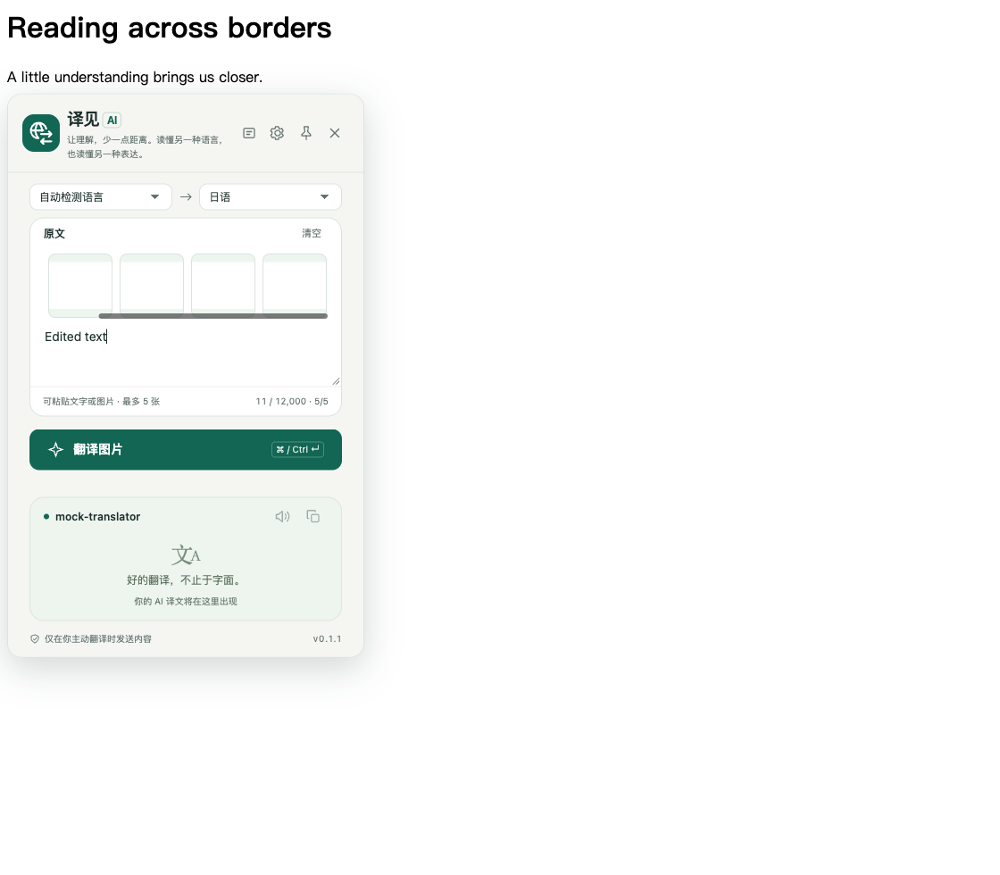
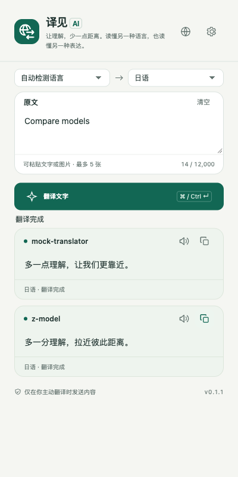
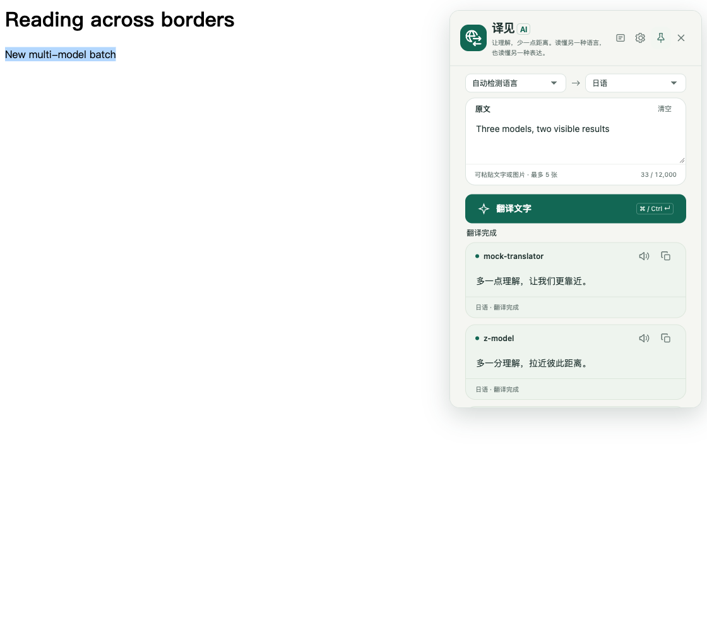
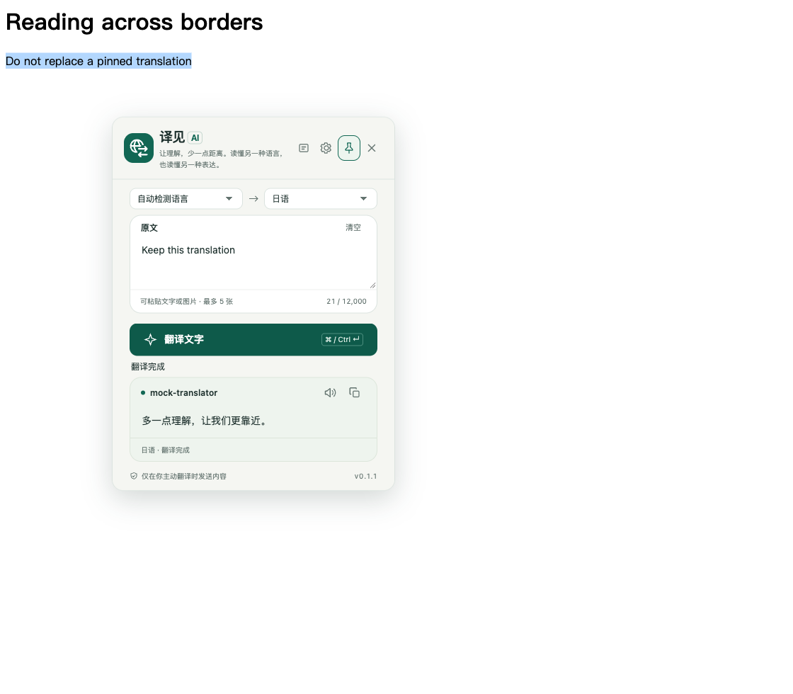

# 译见 AI · 随手翻译

**简体中文** | [English](README.en.md) | [日本語](README.ja.md) | [한국어](README.ko.md)

一个可以直接加载到 Chrome 的 AI 翻译插件 MVP。使用 **Manifest V3 + 原生 JavaScript / HTML / CSS**，无运行时依赖、不包含预置密钥；通过 `npm run build` 生成可直接加载的 `dist/` 目录，不生成 ZIP。

## 已实现

- **五种显示语言**：支持简体中文、繁體中文、English、日本語和 한국어；自动匹配 Chrome 界面语言，未支持语言使用英文兜底。

- **工具栏翻译**：自动检测或手动选择源语言，输入或粘贴文字，选择目标语言，一键翻译与复制。
- **选中文字**：先在网页选中文字，再打开插件；原文自动带入，不自动发送。
- **页面划词翻译**：默认在所有普通 HTTP/HTTPS 网页启用，选中文字出现翻译图标按钮；点击才请求 AI，使用与工具栏共用的翻译界面。
- **右键翻译**：选中文字后，右键选择「用译见 AI 翻译选中文字」，在网页浮窗展示结果。
- **10 种目标语言**：简体中文、繁体中文、英文、日文、韩文、法文、德文、西班牙文、俄文、葡萄牙文。
- **3 种表达风格**：自然流畅、忠实原文、专业严谨。
- **可配置服务**：兼容 `POST /chat/completions`，支持自定义 Base URL、API Key 和模型 ID，以及免认证本地服务。
- **多模型对比**：最多选择 5 个模型并行翻译，按模型显示独立的结果、加载/错误状态与复制按钮；一个失败不会影响其他模型。
- **模型列表**：拉取后通过复选框选择多个模型，也可用逗号分隔手动填写 ID。旧版单模型配置自动兼容。
- **连接测试**、加载状态、超时处理、认证/限流/模型错误提示。
- **全站划词**：统一声明 HTTP/HTTPS 网站访问权限，无需逐站启用；仅点击翻译图标后才发送选中文字。

### Simple Translate / Full Translate

设置中的「启用 Simple Translate」开关默认关闭，即 **Full Translate**。开启后，划词和右键翻译浮窗只用已选模型列表中的**第一个模型**自动翻译，显示原文语言（默认自动检测）、目标语言、可编辑原文和译文，不显示翻译按钮。改变语言或停止输入约 0.6 秒后会自动重新翻译，目标语言会记住。

浮窗顶部可打开设置，或通过图标在 **Simple Translate / Full Translate** 之间切换（保留原文、恢复所有已选模型）。模式立即保存并同步到已打开的页面浮窗；工具栏弹窗仍保留完整布局。Simple 模式仍支持失败重试、认证错误设置链接和内联解锁；精简模式也保留复制和语音播报；图片粘贴等完整工具请使用 Full 模式。

### 截图与粘贴图片翻译

当前 popup 顶部已移除截图入口（不显示剪刀或「截图翻译」文字），**不能再从此处发起网页区域截图**。底层区域截图与裁剪代码仍保留，但不是当前用户界面的可见入口。可以使用系统截图工具复制图片，再粘贴到原文输入框翻译。

1. 在工具栏 popup 或 **Full Translate** 网页浮窗的原文输入框中按 **Ctrl+V / Cmd+V** 粘贴图片；Simple 模式仅支持文字。
2. 最多添加 **5 张**。图片以 **72 × 72 缩略图** 固定在输入区左上方，单行排列，超出宽度可横向滚动，文字紧接图片下方输入。
3. 鼠标移到缩略图时显示白底黑色 **×**，点击只删除该图；键盘聚焦也可显示删除按钮。「清空」同时移除文字和图片。
4. 选择源语言（自动检测或手动指定）与目标语言，点击「翻译图片」。文字与保留图片一起发送，各模型独立返回结果，支持重试、取消、复制、朗读和就地解锁。

需要支持图片输入的 Chat Completions 兼容模型，不会自动更换模型，也不调用独立 OCR 服务。粘贴支持 PNG、JPEG、WebP、GIF、BMP，转换为静态 JPEG，最长边最多 2,048 像素，不放大小图；不支持 SVG。

**粘贴和预览本身不上传图片。** 图片只在发起翻译或重试时发送至你配置的服务，可能产生费用；浮窗内切换语言或模式也可能重新发起翻译。仅接收原文框中的粘贴事件，不申请剪贴板读取权限，不后台读取剪贴板。图片不写入 local/session storage 或持久翻译历史。图片请求不附带网页标题/摘要。请勿提交敏感图片，核对结果准确性。

### 译文语音播报

每个模型译文卡片的复制按钮左侧提供朗读图标，点击播放，再次点击停止。翻译完成不会自动发声；已有结果可以在其他模型仍翻译时朗读。整个插件同时只播放一条译文，切换模型或窗口会停止旧播放。关闭窗口、刷新页面、清空或重新翻译会停止本界面的播放；固定、拖动、复制不打断播放。

通过 Chrome `tts` 按本条结果的目标语言选择明确标记为本地的语音，长译文分段播放。不使用翻译 API Key，不接入云端配音，也不保存音频或额外保存播报文本。没有对应本地语音时提示安装，不回退到远程语音或其他语言。语音可用性与音质依赖系统；第一版不提供暂停、语速、音色和下载。重新加载扩展并刷新网页后生效。

### 划词开关与自定义系统提示词

设置页可启用或禁用划词翻译，默认启用；切换立即保存并同步到已打开网页。关闭后隐藏划词图标并关闭当前浮窗，工具栏与主动右键翻译仍可使用，不需要重新配置 API Key。

系统提示词支持编辑、恢复默认、随「保存设置」保存；留空使用默认模板，最多 16,000 个字符，所有已选模型共用。恢复默认只修改草稿，保存后生效。模板以 `system` 身份发送，原文仍单独以 `user` 身份发送。

- `{{text}}`：原文；`{{from}}`：手动选择的原文语言（Full / Simple 均支持），未指定时由模型自动检测；`{{to}}`：本次目标语言。
- `{{title_prompt}}`：当前网页标题；`{{summary_prompt}}`：已有的 `description` 元数据摘要。仅在网页翻译时有可用内容才填入，不抓取全文、不额外调用 AI 生成摘要。
- `{{terms_prompt}}`：相关术语；目前没有术语表入口，无可用术语时为空。
- `{{imt_style_guide}}`：设置中选择的翻译风格。

无可用上下文时，相应变量为空。默认模板包含标题和摘要变量，因此网页翻译会将可用的这些元数据随原文发送给所配置的服务；如不需要，可删除对应变量。纯手动输入不附带页面上下文。自定义提示词也保存在本地，请勿在其中填写密钥。

### 当前界面与操作

- Full 和 Simple 均可用下拉框选择源语言，默认自动检测；切换模式保留原文和所选源语言。
- 目标语言在工具栏、网页浮窗和设置之间记忆与同步。翻译中可取消；Full 模式提供取消按钮，Simple 修改原文或语言会取消旧请求并重译。
- 显示语言在工具栏 popup 和设置页切换；网页浮窗不再显示地球语言按钮，但继续跟随已保存的界面语言。
- Simple 仅调用模型列表第一项，保留复制与本地朗读；工具栏 popup 始终为完整布局。

## 界面预览

以下截图同步自最新本机模拟 API 浏览器测试（2026-10-06），展示插件的实际界面，不代表真实模型的翻译效果。密钥不展示，测试解锁密码已遮挡。

### 工具栏翻译

输入或带入网页选中文字，选择目标语言，查看并复制译文。



### AI 服务设置

配置 API 地址、密码加密的密钥、模型和翻译偏好，并测试连接。截图使用本机模拟服务，已保存的密钥不会回填或显示。



### 浮窗内解锁

API Key 锁定时，可直接在工具栏弹窗或页面浮窗输入密码。解锁框紧凑显示，解锁后继续等待中的翻译，无需跳转设置页。下图展示页面浮窗。



### 页面划词翻译

选中文字后点击翻译图标，在选区附近打开共用翻译界面，可编辑原文、切换目标语言和复制译文。



### 右键翻译浮窗

译文显示在网页右上角，可复制或关闭。截图中的 HTML 样式字符串是安全测试内容，被作为纯文本显示，不会执行。



### 精简模式与图片输入

精简模式：可编辑原文、选择语言、复制与朗读。



Full 模式：图片单行缩略图和下方文字输入。



## 1. 构建并加载插件

先在工程根目录运行（需要 Node.js 20+，无需安装依赖）：

```sh
npm run build
```

1. 打开 Chrome，在地址栏输入 `chrome://extensions`。
2. 开启页面右上角的「开发者模式」。
3. 点击「加载已解压的扩展程序」。
4. 选择**当前工程下的 `dist/` 目录**（其中包含生成的 `manifest.json`），不要选择工程根目录。
5. 在工具栏的扩展菜单中，把「译见 AI」固定到工具栏。

最低 Chrome 版本在 `manifest.json` 中设置为 114。开发时修改代码后，先运行 `npm run build`，再在扩展管理页面点击「重新加载」，然后重新打开弹窗；已经注入过浮窗的网页也需要刷新。

## 界面语言

默认跟随 Chrome 的**界面语言**，而不是当前网页语言。点击弹出框右上角、设置按钮旁的 **地球图标（显示语言）** 按钮，可选择 **跟随浏览器 / 简体中文 / 繁體中文 / English / 日本語 / 한국어**；选择会自动保存，下次打开仍然有效。

- 简体中文浏览器（`zh-CN`、`zh-SG`、`zh-Hans`）：简体中文界面。
- 日语浏览器（`ja`、`ja-JP`）：日本語界面；韩语浏览器（`ko`、`ko-KR`）：한국어界面。
- 繁体中文浏览器（`zh-TW`、`zh-HK`、`zh-MO`、`zh-Hant`）：繁體中文界面。显式指定 `Hans` / `Hant` 时优先于地区匹配。
- 手动切换会同步工具栏、设置页、右键菜单和已打开的页面浮窗，不清空译文，不改变翻译目标语言或模型设置。
- 英文浏览器：显示英文界面。
- 其他未支持的界面语言：回退到英文（`default_locale: en`）。

手动切换立即更新工具栏弹窗、已打开的设置页、右键菜单及网页翻译浮窗，不清空原文、译文或未保存的设置。Chrome 扩展管理页中的插件名称和描述仍由浏览器语言决定。修改浏览器界面语言并重启浏览器后，重新打开插件；已打开的页面请刷新。**界面语言和翻译目标语言相互独立**，不会覆盖已保存的翻译偏好。工具栏、设置页、弹出界面及网页翻译浮窗统一使用不含文字的地球＋双向箭头图标，不依赖任何语言；保留绿色圆角背景。

图标矢量源为 `assets/translation-mark.svg`；`assets/icon.svg` 和各尺寸 PNG 已提交，普通构建无需图像依赖。修改图标后，可安装开发工具 `sharp` 并运行 `npm run icons` 重新生成（也支持用 `SHARP_MODULE` 指定已有模块入口）。划词按钮、设置页和各翻译界面使用同一图形的内联 SVG，修改时需同步，测试会校验路径一致；无需等待网络图片加载。

## 2. 配置 AI 服务

打开插件右上角的设置按钮：

| 字段 | 填写方式 |
| --- | --- |
| API Base URL | API 的基础地址，例如 `https://api.openai.com/v1` 或 `https://你的网关/v1`，不是服务商的网页首页 |
| API Key | 在服务商控制台创建的密钥；本地免认证服务可留空 |
| 模型 ID | 拉取列表后勾选 1–5 个模型，或用逗号分隔手动填写支持 Chat Completions 的准确模型名称 |
| 默认目标语言 | 工具栏初始语言和右键翻译的语言 |
| 表达风格 | 所有新翻译采用的提示词风格 |

勾选文本发送与费用提示，点击「保存设置」。然后点击「测试已保存的连接」。测试会向每个已选模型发送固定的 `Hello, world!`，分别产生 API 调用费用。

- 如果服务商给的是完整 `/chat/completions` 地址，插件会自动去掉这个后缀。
- 不自动补上 `/v1`：请按服务商实际接口填写，支持带有自定义路径前缀的网关。
- 远程服务仅允许 HTTPS；本地调试允许 `http://localhost:端口` 和 `http://127.0.0.1:端口`。
- 扩展统一声明 HTTP/HTTPS 访问权限，更换服务或保存配置不会移除全站划词所需权限。
- ChatGPT 网页订阅不等同于 API 凭据；需要服务商提供的 API 访问能力。
- 这是 Chat Completions 协议客户端，不直接支持 Anthropic Messages、Gemini 原生协议或 OpenAI Responses 协议。可使用兼容网关。

### API Key 密码保护

- 填写 API Key 后，设置并确认 **至少 6 个字符**的独立解锁密码，再保存设置。免认证服务可将 Key 和密码均留空。
- 浏览器重启、扩展重载或更新后，可以直接在工具栏弹窗、划词浮窗或设置页输入密码解锁一次；仅关闭 popup 不会锁定。翻译、拉取模型和连接测试共用后台凭据管理。
- 弹窗和浮窗只在锁定时显示解锁框；解锁成功后继续等待中的翻译，其他窗口同步解锁。密码输入位于独立的扩展源 iframe，密码不经过网页或内容脚本。修改、重置密码仍需打开设置。
- 已保存的 Key 不会回填到设置输入框。解锁后留空 Key 和密码可修改模型、偏好；只填新密码及确认可更换密码。填写新 Key 时需要同时设置密码。更换服务地址必须明确填写新地址的 Key，不能隐式复用旧凭据。
- **立即锁定**清除会话 Key 并取消进行中的翻译/模型列表请求，但无法撤回服务端已收到的请求。
- **忘记密码 / 删除已保存的 Key**需确认，删除密文及会话 Key，保留其他设置。忘记密码无法恢复，只能重新填写 API Key；插件不会代你在服务商处撤销 Key。
- **旧版迁移：** 更新后检测到旧明文 Key 时，暂停翻译和模型发现。打开设置，设置密码并保存；只有密文成功写入后才移除旧明文，防止迁移中断或浏览器重启导致 Key 丢失。完成前旧 Key 仍是明文，请尽快迁移。旧磁盘备份或存储引擎残留不保证被安全擦除；如担心历史暴露，请在服务商处轮换 Key。

### 拉取并选择模型

1. 填写 API Base URL 和 API Key（免认证本地服务可留空）。
2. 点击「拉取模型列表」。无需先填写模型 ID、保存设置或勾选翻译同意项。
3. 从「可用模型」中勾选一个或多个模型，模型 ID 会同步到输入框；最多 5 个，设置好解锁密码后点击「保存设置」。
4. 不在列表中的模型可手动添加，例如 `model-a, model-b`；重复 ID 会自动去重，取消勾选可移除模型。

拉取通过后台使用当前表单的地址和新填写的密钥（或已解锁的已保存密钥）请求 `GET /models`，不发送原文、不自动保存设置，也不会自动替换当前模型。更换地址或密钥会清空列表并取消旧请求。服务不支持模型列表、返回空列表或拉取失败时，仍可手动填写。列表仅代表服务返回的模型，不保证每个模型都支持 Chat Completions。

### 多模型翻译

工具栏弹窗和划词浮窗中，失败卡片底部的「请重试」是可点击链接，只会重新请求该模型，并保留其他模型的译文。重试沿用本次原文和目标语言；请求期间不会重复发送，也可以在其他模型仍加载时单独重试。

所有已选模型共用当前 Base URL、API Key、目标语言与表达风格，不是多服务商配置。点击一次翻译，会同时为每个模型发送一份原文，费用与调用次数随模型数增加。

- 工具栏弹窗与划词浮窗按保存顺序纵向显示独立模型卡片，先完成的先展示，无需等待最慢的模型。
- 每张卡片单独显示译文或错误，并提供独立复制；全部或部分失败时有对应提示。
- 复制按钮采用图标形式；复制成功后只显示对号，1.5 秒后恢复复制图标，不再显示成功提示文字。每个模型独立反馈，连续复制会重新计时。
- 原文输入区默认高 70px，更紧凑，仍可拖动调整。
- 修改原文后重新翻译；划词浮窗切换目标语言会重新请求全部模型。关闭浮窗会取消这一批请求，旧结果不会覆盖新翻译。
- 旧的单模型配置无需重新填写；保存后转换为模型列表。右键翻译同样支持多模型结果。



选择三个及以上模型时，右键和划词共用浮窗默认显示前两张结果卡片，其余滚动查看：



## 3. 日常使用

### 工具栏

输入或粘贴文字 → 选择目标语言 → 点击「翻译文字」。快捷键为 `⌘ Enter`（macOS）或 `Ctrl Enter`（Windows/Linux）。单次最多 12,000 字符。关闭弹窗不会保存当前原文和译文；请求已发送时，关闭弹窗也不保证取消服务商的计费。

### 网页选区

选中文字 → 右键 →「用译见 AI 翻译选中文字」。右键翻译与划词翻译复用同一个浮窗，支持编辑原文、切换目标语言、多模型结果、单独重试、复制、固定和拖动。显式发起新的右键翻译会替换当前浮窗，即使当前已固定。连续翻译时仅展示最新一次结果；关闭浮窗后，晚到的结果不会重新弹出。

Chrome 内置页面、Chrome Web Store、部分 PDF 查看器和受限制的嵌入框架可能无法注入浮窗。注入失败时会尝试打开独立翻译窗口带入选区，由你点击继续翻译；也可直接在工具栏中粘贴文字。跨域 iframe 的自动选区提取不保证支持。

### 页面划词翻译

**固定与拖动**：点击顶部图钉按钮后，本次浮窗保持打开，点击页面其他位置、滚动页面或重新划词不会关闭或替换当前译文。按住顶部非按钮区域可拖动，浮窗不会移出可视范围；聚焦顶部后也可用方向键移动，Shift + 方向键加快移动。再次点击图钉取消固定，关闭按钮和 Esc 始终可用。固定状态仅用于本次浮窗，关闭或刷新页面后重置。



1. 重新加载扩展并刷新网页；如 Chrome 提示新增的网站访问权限，请确认允许。
2. 直接在普通 HTTP/HTTPS 网页选中文字，附近会出现绿色地球＋双向箭头小按钮，2.5 秒后自动隐藏；重新划词会重新计时。**无需逐站启用，仅选中不会发送请求**。
3. 点击翻译图标，选中文字自动带入浮窗并翻译；支持编辑原文、切换目标语言、复制译文、切换显示语言和打开设置。
4. 点击关闭按钮、按 Esc，或在未固定时点击浮窗外部即可关闭。旧请求不会覆盖新内容或重新打开浮窗。

浮窗默认宽 400px，窄屏自动收窄，选择 1–2 个模型时，高度随内容自适应；选择 3 个及以上模型时，高度以完整显示前两张结果卡片为准，第三个起滚动查看。长译文本身也可在卡片内滚动。小屏幕始终以可用视口高度为上限，顶部操作区始终可见；优先放在选区下方，空间不足时调整到上方或视口内。切换目标语言会重新翻译。单次最多 12,000 字符，超长选区提示后不发送、不静默截断。

划词翻译默认在所有普通 HTTP/HTTPS 网页启用，已移除逐网站开关；旧网站名单与动态注入注册会自动清理。Chrome 的网站访问权限控制仍然有效：如被设为“点击时”或“特定网站”，请在扩展详情中改为“所有网站”。插件不能绕过浏览器权限限制。

输入框、密码框、可编辑区域和浮窗自身不触发划词入口。自动划词脚本仅在顶层普通网页注入；右键可在获得访问权限的普通 HTTP/HTTPS iframe 中打开同一浮窗。PDF 阅读器、Chrome 内部页面及其他禁止注入的页面仍受浏览器限制，支持本次浮窗固定和顶部拖动，但不支持同时打开多个浮窗。扩展更新后请刷新已打开的网页。

## 隐私与安全边界

- **API Key 使用密码加密后保存在 `chrome.storage.local`，不使用浏览器同步。** AES-256-GCM 加密密钥由 PBKDF2-SHA-256（600,000 次迭代、随机盐）派生，每次加密使用新的 IV。密码及派生密钥不保存，解锁后的 Key 仅暂存于受限的 `chrome.storage.session`，锁定、浏览器重启或扩展重载后清除。这不保护已被控制的浏览器、设备或已解锁会话。不要使用共享浏览器保存生产级高权限密钥，建议配置限额与最小权限。
- 将本地存储访问级别设为 `TRUSTED_CONTEXTS`，注入网页的脚本不能直接读取密钥；网络请求在扩展后台执行。
- 只在手动翻译或测试连接时发送文本，不自动扫描全文，不上传网页 URL，不保存翻译历史，不包含分析追踪。
- 服务商仍可按其政策处理你发送的文本及主动提交的截图，请避免发送敏感信息。网页浮窗不是用于显示机密内容的安全界面。
- API 请求不附带浏览器 Cookie，不跟随重定向，避免把凭据带到其他地址。
- 翻译输出用 `textContent` 渲染，不执行返回的 HTML 或 Markdown。
- 注入失败的右键选区会临时写入 `chrome.storage.session`，独立窗口读取后即删除；不会写入持久历史。
- 无论提示词如何设计，AI 输出都可能不准确；重要信息请人工核对。

### 权限用途

| 权限 | 用途 |
| --- | --- |
| `storage` | 本地设置，以及受限页面回退时的临时选区 |
| `contextMenus` | 添加选中文字的右键翻译项 |
| `activeTab` | 用户操作后读取当前页面选区及适用上下文；底层截图处理器保留，但当前没有可见截图入口 |
| `scripting` | 读取选区或注入翻译浮窗 |
| `tts` | 用户点击后使用本地语音朗读译文，并管理停止和播放状态 |
| `host_permissions`：HTTP/HTTPS 全站 | 默认注入划词入口并访问配置的 API；安装或更新时可能显示全站访问权限提示 |

## 开发与测试

构建和运行单元测试需要 Node.js 20+，插件运行本身不需要 Node.js。

```sh
npm run build       # 校验并输出可直接加载的 dist/ 目录，不生成 ZIP
npm test            # 构建流程、配置校验、请求构造、响应解析、HTTP 错误和超时
npm run check       # Manifest、资源路径、JavaScript 语法与内联脚本检查
```

本项目使用 Chrome 开发者模式加载 `dist/`。构建会先在临时目录整理并检查文件，校验通过后清理旧 `dist/` 并替换为新产物；请勿在 `dist/` 中手动修改或保存其他资料。产物只包含 `manifest.json`、`LICENSE`、`src/`、`assets/`、`_locales/`，不包含测试、截图、文档、开发脚本或 ZIP。当前源码是原生 JavaScript / HTML / CSS，构建仅做校验和文件整理，不做转译、压缩，也不下载依赖。

每次修改源码后，运行 `npm run build`，然后在 `chrome://extensions` 中重新加载该扩展，关闭旧弹窗后再打开。如果之前加载的是工程根目录，需要改为加载 `dist/`，不要继续使用旧目录条目。

工具栏弹窗的根元素明确设为 400px，不用 `vw` 限制其自动尺寸；独立翻译窗口则可随窗口宽度缩小。

新增单元测试覆盖全站声明、旧版迁移、权限校验/撤权、关闭前请求取消，以及内容脚本公开配置白名单。浏览器测试另覆盖划词不自动请求、原文编辑、目标/显示语言切换、关闭/Esc/外部点击、晚到请求、窄屏、可编辑区域排除、刷新后及不同主机首次访问的自动注入。

### 可选浏览器冒烟测试

截图流程使用本地模拟 AI 服务验证。自动化打开弹窗不会获得与手动点击工具栏相同的 `activeTab` 授权，因此仅临时测试副本增加 `<all_urls>` 用于验证真实截图 API；正式 `manifest.json` 和 `dist/` 权限不变，发布前仍需手动点击工具栏确认授权。macOS 无法激活测试窗口时可用 `TEST_BROWSER_HEADLESS=1`（浏览器原生语言沿用系统设置）；`TEST_SCREENSHOT_ONLY=1` 可只跑截图用例。

```sh
npm install --no-save playwright
npx playwright install chromium
npm run test:browser
```

也可以用 `PLAYWRIGHT_MODULE` 指定 Playwright 模块入口绝对路径、`CHROMIUM_EXECUTABLE` 指定 Chromium 可执行文件。测试命令先构建，再从 `dist/` 复制产物进行验证，使用独立临时浏览器配置、仅本机可访问的模拟 API，无需真实密钥，不产生 AI 费用。普通划词测试沿用分发版全站声明；仅为测试保留的截图底层接口，临时测试副本额外授予 `<all_urls>`，不修改生产 manifest 或 `dist/`。会通过 `chrome.action.openPopup()` 打开真实工具栏弹窗并断言其实际视口宽度为 400px（不是预设宽度的普通页面），也检查独立窗口的窄屏适配。另覆盖模型列表拉取/多选、并行独立结果、部分/全部失败、逐卡复制、批量取消、失败提示、浏览器权限受限、切换连接时取消旧请求，以及首次配置、同意提示、保存、连接测试、未保存修改、翻译、复制、HTTP 错误、浮窗关闭和内容脚本凭据隔离。截图按语言写入 `artifacts/screenshots/<语言>/`，避免污染可直接加载的 `dist/`。

用 `TEST_BROWSER_LOCALE` 验证不同浏览器语言，例如：

```sh
TEST_BROWSER_LOCALE=zh-CN npm run test:browser
TEST_BROWSER_LOCALE=zh-TW npm run test:browser
TEST_BROWSER_LOCALE=ja-JP npm run test:browser
TEST_BROWSER_LOCALE=ko-KR npm run test:browser
TEST_BROWSER_LOCALE=en-US npm run test:browser
TEST_BROWSER_LOCALE=fr-FR npm run test:browser  # 验证英文兜底
```

测试默认使用 `en-US`。macOS 会短暂打开隔离的测试浏览器，使用仅对该进程生效的语言参数；不会修改系统或日常 Chrome 的语言偏好。测试也检查本地化文案、辅助功能标签及目标语言偏好不被更改。

仍需手工检查：正式 Chrome 的安装/更新权限提示与网站访问限制、真实右键菜单入口、受限网页回退、你实际使用的服务商。未填真实服务配置前，模拟测试不能证明真实模型可用。

## 工程结构

```text
manifest.json                 扩展声明
assets/                       16 / 32 / 48 / 128px 图标
_locales/                     en / zh_CN / zh_TW / ja / ko 文案，英文兜底
src/
  background.js               消息校验、右键菜单、后台翻译任务
  shared/settings.js          配置、语言、地址规范化与校验
  shared/translator.js        Chat Completions 客户端与错误处理
  shared/models.js            模型列表请求、校验、超时与取消
  shared/translation-view.js  工具栏、划词与右键浮窗共用控制器
  shared/context-menu.js      右键复用浮窗入口及独立窗口兜底
  shared/selection-background.js 全站权限校验、旧版迁移、公开配置与取消请求
  shared/ui.css               公共视觉样式
  shared/i18n.js              页面文案及辅助属性本地化
  popup/                      工具栏翻译界面
  options/                    AI 服务与翻译偏好设置
  content/selection.js         页面选区入口与共用翻译浮窗
scripts/                      构建、检查与浏览器测试
dist/                         生成的扩展目录（Chrome 加载此处）
artifacts/screenshots/        浏览器测试截图（不进入 dist）
tests/                        Node.js 自动化测试
```

## 本期不包含

整页双语翻译、流式输出、翻译历史、账户/计费系统、词典收藏、术语库和商店发布。这是可扩展的单用户 BYOK（自带密钥）MVP，不是把公共服务密钥嵌入客户端的商业分发方案。

## 技术文档

- Chrome 扩展与权限：https://developer.chrome.com/docs/extensions/reference/api/permissions
- Chrome activeTab：https://developer.chrome.com/docs/extensions/develop/concepts/activeTab
- Chrome 本地存储：https://developer.chrome.com/docs/extensions/reference/api/storage
- Chat Completions：https://developers.openai.com/api/reference/resources/chat/subresources/completions/methods/create

## Chrome Web Store 提交材料

商店用 ZIP、五种语言介绍、图标、截图与宣传图放在独立的 [chrome-web-store/](chrome-web-store/README.md) 目录，不放入 `dist/`。执行 `npm run package` 可重新打包到 `chrome-web-store/package/`；`npm run build` 仍只生成开发者模式加载目录，不生成 ZIP。

### 繁體中文界面预览


繁體中文浮窗内解锁：


商店材料已补充繁体中文详细介绍及 5 张繁体界面截图，见 `chrome-web-store/`。

### 日语与韩语界面

新增 [日本語 README](README.ja.md) 和 [한국어 README](README.ko.md)，包含对应语言的实际界面截图、配置和安全说明。商店材料现包含五种语言文案与每种语言 5 张截图。

## 许可证

Transight AI 采用 [Apache License 2.0](LICENSE) 开源发布。除另有说明的第三方内容外，本仓库的插件源码、网站源码、文档及原创素材均适用该许可证。第三方依赖及其素材保留各自的许可证。
